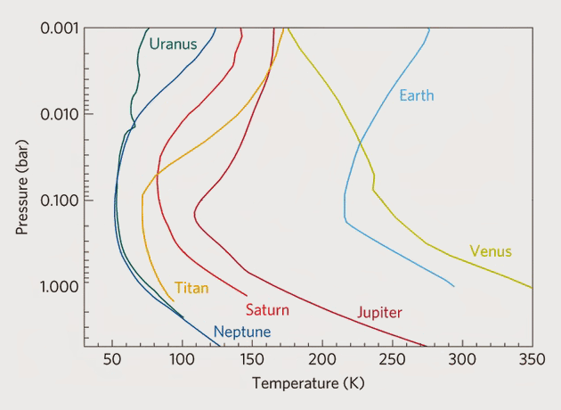

# A Method for Modeling Atmospheres in Kerbal Space Program

In recent months I have become rather proficient at developing atmospheric models for Kerbal Space Program.  It started with my own mod, [Realistic Atmospheres](https://forum.kerbalspaceprogram.com/index.php?/topic/128858-112-realistic-atmospheres/), in December-2015.  Since then I have developed atmospheres for [Real Solar System](https://forum.kerbalspaceprogram.com/index.php?/topic/50471-112-real-solar-system-v1120-may-7/), [Outer Planets Mod](https://forum.kerbalspaceprogram.com/index.php?/topic/93999-112-outer-planets-mod-20-complete-overhaul-better-terrain-nicer-terrain-textures-improved-scatter-etc-21-may/), [Revamped Stock Solar System](https://forum.kerbalspaceprogram.com/index.php?/topic/134360-112-v04-revamped-stock-solar-system/), and others.  Throughout the process I have steadily improved and formalized by methods.  In this tutorial I describe my technique so that other developers can, if they want to, use it to create their own atmospheres.

## General Properties of Planet & Atmosphere

Before developing an atmospheric model, some basic information about the planet and its atmosphere is needed.  Let’s say we want to develop an atmospheric model for the fictional moon [Pandora](http://james-camerons-avatar.wikia.com/wiki/Pandora) from the movie Avatar.  From the link provided we have the following,

Diameter = 11447 km
Surface gravity = 0.8 g
Atmospheric density = 1.2 × Earth
Surface pressure = 0.9 atm

To produce a realistic atmosphere, it is necessary to apply the equations to a life-sized model.  Therefore, for now, we’ll leave Pandora’s diameter as is.  However, if it is our plan to produce a stock-sized analog, we’ll eventually have to scale it down.

From the given atmospheric gases and their percentages, we can estimate the molar mass.  And from the density, pressure and [molar mass](https://en.wikipedia.org/wiki/Molar_mass), we can calculate the temperature using the [ideal gas law](https://en.wikipedia.org/wiki/Ideal_gas_law).  Performing these calculations we obtain,

Molar mass = 0.0374 kg/mol (assuming 21% oxygen)
Surface temperature = 280 K

And finally, we’re given

Axial tilt = 29°
Variation in illumination = 10%

This gives us the basic information needed to begin our model.

## Understanding the Temperature Curves

Before designing a temperature model for our planet or moon, we must understand how temperature is computed in KSP.  The basic temperature formula is,

	Temperature
	= currentMainBody.temperatureCurve.Evaluate(altitude)
	+ atmosphereTemperatureOffset * currentMainBody.temperatureSunMultCurve.Evaluate(altitude)

where,

	atmosphereTemperatureOffset
	= currentMainBody.temperatureLatitudeBiasCurve.Evaluate(latitude)
	+ currentMainBody.temperatureLatitudeSunMultCurve.Evaluate(latitude) * sunDotNormalized
	+ currentMainBody.temperatureAxialSunBiasCurve.Evaluate((float)currentMainBody.orbit.trueAnomaly * Mathf.Rad2Deg) * currentMainBody.temperatureAxialSunMultCurve.Evaluate(latitude))
	+ currentMainBody.temperatureEccentricityBiasCurve.Evaluate((float)((currentMainBody.orbit.radius - currentMainBody.orbit.PeR) / (currentMainBody.orbit.ApR - currentMainBody.orbit.PeR)))

To make it easier to understand, let’s break it down piece by piece.  Much of this will make more sense as we walk through the example.

`temperatureCurve` – This curve takes altitude (meters) and returns temperature (K).  Its value defines the base temperature-height profile, to which is added atmosphereTemperatureOffset * temperatureSunMultCurve.

`atmosphereTemperatureOffset` – The total of all the temperature variations that are added to atmosphereTemperatureCurve.  Its value is multiplied by temperatureSunMultCurve.

`temperatureSunMultCurve` – This curve takes altitude (meters) and returns a multiplier.  Its value defines how atmosphereTemperatureOffset varies with altitude.

`temperatureLatitudeBiasCurve` – This curve takes latitude (degrees) and returns temperature (K).  Its value defines the latitudinal temperature variation.

`temperatureLatitudeSunMultCurve` – This curve takes latitude (degrees) and returns temperature (K).  Its value defines the diurnal temperature variation, which is multiplied by sunDotNormalized.

`sunDotNormalized` – The dot product of the surface normal at a given location and the sun’s position vector, normalized to a number between 0 (coldest time of day) and 1 (hottest time of day).

`temperatureAxialSunBiasCurve` – This curve takes true anomaly (degrees) and returns temperature (K).  Its value defines the seasonal temperature variation, which is multiplied by temperatureAxialSunMultCurve.

`temperatureAxialSunMultCurve` – This curve takes latitude (degrees) and returns a multiplier.  Its value defines how temperatureAxialSunBiasCurve varies with latitude.

`temperatureEccentricityBiasCurve` – This curve takes a value between 0 (periapsis) and 1 (apoapsis) and returns temperature (K).  Its value defines the temperature variation due to orbital eccentricity.

The names of the curves listed above and throughout this article are those used by the mod [Kopernicus](https://forum.kerbalspaceprogram.com/index.php?/topic/140580-112-kopernicus-105-may-28/).  Note that internally KSP uses different names, but since you will almost certainly be working with Kopernicus configuration files, the internal KSP names are irrelevant for this discussion.

## Developing a Temperature Model

### Global Mean Temperature

To develop a temperature model, the best place to start is to estimate the planet’s global mean temperature.  For our Pandora example we already have this, 280 K.  But let’s say we are starting from scratch and need to make an initial estimate.  A good first step is to compute the planet’s [effective temperature](https://en.wikipedia.org/wiki/Effective_temperature).  This can be done using the following equation,

	Teff = ( I × (1 – α) / (4 × σ) ) ^ 0.25

where I is the [solar irradiance](https://en.wikipedia.org/wiki/Solar_irradiance) (W/m2), α is the [albedo](https://en.wikipedia.org/wiki/Albedo), and σ is the [Stefan-Boltzmann constant](https://en.wikipedia.org/wiki/Stefan–Boltzmann_constant) (5.6704×10^-8 Wm^-2K^-4).

In KSP the solar irradiance at Kerbin is defined as 1360 W/m2.  For other planets it can be computed using,

	I = 1360 / D^2

where *D* is the planet’s distance from the sun expressed as a ratio of Kerbin’s distance, i.e. the Kerbin solar system’s version of the [astronomical unit](https://en.wikipedia.org/wiki/Astronomical_unit) (AU).

Albedo is the fraction of the incoming solar radiation that a body reflects.  Planets or moons with icy surfaces or bright cloud cover typically have high albedos, while those with dark rocky surfaces have low albedos.  Bodies with low albedos absorb more energy and will be warmer than those with high albedos.  We generally want to give our body an albedo equal to that of a similar real life body. 

For an example, let’s compute Eve’s effective temperature, where Eve’s distance from the sun is 0.723 AU and its albedo is 0.45.

	I = 1360 / 0.723^2 = 2602 W/m^2

	Teff = (2602 × (1 - 0.45) / (4 × 5.6704E-08))^0.25 = 282 K

For an airless body, the effective temperature is a good estimate of the body’s globally averaged temperature.  However, for a planet with an atmosphere, the surface temperature will be warmer because of the [greenhouse effect](https://en.wikipedia.org/wiki/Greenhouse_effect).

Eve’s actual global mean temperature is about 408 K, meaning that it’s receiving a greenhouse effect of +126 K.  Kerbin’s global mean temperature is 287 K while its effective temperature is 250 K, thus its greenhouse effect is +37 K.  Here are some other examples from real life:  Venus +500 K, Earth +34 K, and Mars +8 K.

Clearly the thicker the atmosphere, the greater the greenhouse effect.  From the numbers above we can guesstimate the magnitude of our fictional planet’s greenhouse effect.  When added to the effective temperature, we obtain the planet’s global mean temperature.

For Pandora, we known the moon’s temperature, but we know nothing about its distance from the sun or its albedo.  This allows us to consider an interesting scenario.  Suppose we want to force our fictional planet to have a specific temperature.  We can use the equations above to compute the combination of orbital distance and albedo necessary to produce the desired temperature.

Pandora’s temperature is 280 K.  Given its thick atmosphere and abundance of [greenhouse gases](https://en.wikipedia.org/wiki/Greenhouse_gas), let’s assume its greenhouse effect is +40 K.  This gives the moon an effective temperature of 240 K.  Let’s also assume that Pandora orbits the stock sun at a distance of 1.10 AU.  We can now rearrange the effective temperature equation to calculate Pandora’s albedo,

	I = 1360 / 1.10^2 = 1124 W/m^2

	α = 1 – (4 × σ × Teff^4) / I = 1 – (4 × 5.6704E-08 × 240^4) / 1124 = 0.33

### Latitudinal Variation

We now have to figure out how the surface temperature varies across the global.  I always start by making the mean annual temperature at a [latitude](https://en.wikipedia.org/wiki/Latitude) of 38 degrees equal to the global mean temperature.  Why 38 degrees?  One of the components of the effective temperature equation is the ratio of the energy absorbing area to the energy radiating area.  Globally this ratio is 1/4 (thus the 4 in the denominator of the equation).  If we compute the ratio by latitude, we find that the same 1/4 ratio occurs at a latitude of 38°, thus the temperature there approximates the global average.

The next step is to determine the latitudinal temperature variation.  We start by determining the range of temperature between the planet’s equator and its poles.  We use the average annual nighttime low temperature.  There is no simple equation that we use to determine this value.  The best method I’ve found is to simply make an educated guess based on what information we can piece together from the temperatures of real life planets.  On Earth we find that this temperature difference is about 45 K, on Mars it is about 30 K (though this rises to about 90 K during the daytime), and on Venus it is negligible.

Although the equator-to-pole temperature difference is mostly a guesstimate, I have found that the temperature change as we move from equator to pole is proportional to the cosine of the latitude.  Unless there is better data to work from, we should make our latitude bias curve approximate the following function,

	temperatureLatitudeBiasCurve  ≈  ΔT × ( COS(latitude) – COS(38°) )

where ΔT is the difference in nighttime temperature between be the planet’s equator and its poles (absolute value).

Suppose we want to give Pandora a latitudinal ΔT of 45 K.  We find that the following floatCurve is a close match for the function above.

	temperatureLatitudeBiasCurve
	{
		key = 0 9.5 0 0
		key = 38 0 -0.48 -0.48
		key = 90 -35.5 -0.79 0
	}

Graphically, the curve looks like this,


This is not a tutorial about floatCurves, so I’m not going to spend too much time on the subject.  It is assumed you are already familiar them, but if not, I suggest this [floatCurve tutorial](https://forum.kerbalspaceprogram.com/index.php?/topic/84201-info-ksp-floatcurves-and-you-the-magic-of-tangents/), and, if you’re interested in the math, this article about [cubic Hermite splines](https://en.wikipedia.org/wiki/Cubic_Hermite_spline).

To assist in the creation of floatCurves, I developed the Excel spreadsheet [FloatCurve.xlsx](Modeling-Atmospheres-in-KSP/FloatCurve.xlsx) ([source](http://www.braeunig.us/KSP/AtmoTutorial/FloatCurve.xlsx)).  It’s not particularly sophisticated, but it gets the job done.  The first sheet allows you to view and manipulate the curve.  Enter the curve data in the gray fields and the result is plotted*.  To get the curve you want, just play with the numbers.  The second sheet converts a floatCurve into [polynomial](https://en.wikipedia.org/wiki/Polynomial) equations.  Enter the curve data into the gray fields and the resulting equations are displayed in the blue fields, along with the range over which each equation in applicable.  (The default example is Eve’s temperatureCurve.)

*If you add or reduce the number of keys, it may be necessary to change the chart’s data range to get a complete and proper looking graph.

### Diurnal Variation

We now must determine the [diurnal temperature variation](https://en.wikipedia.org/wiki/Diurnal_temperature_variation).  Like the latitudinal variation, diurnal variation is typically an educated guess based on whatever we can learn about real life planets.  On Venus diurnal temperature variation is negligible, on Earth it ranges about 4-20 K, and on Mars it’s about 70 K at the equator.

Based on solar insolation alone, the diurnal variation should vary as a function of the cosine of the latitude, which can be expressed as,

	temperatureLatitudeSunMultCurve  ≈  (ΔTE – ΔTP) × COS(latitude) + ΔTP

where ΔTE is the diurnal variation at the equator, and ΔTP is the diurnal variation at the poles.  Note that here the value of ΔTP is the temperature range seen over a single rotation period, not to be confused with the long days and nights caused by the seasons.

However, there are often other factors that contribute more greatly.  For instance, on Earth diurnal temperature variation is largely a function of humidity, being greater in dry climates and less in humid climates.  For this reason, Earth’s diurnal variation is greatest near the topics, where desert climates are prevalent.

For Pandora, let’s make our curve follow the basic function and use the following,

	temperatureLatitudeSunMultCurve
	{
		key = 0 14.2 0 0
		key = 38 12 -0.11 -0.11
		key = 90 4 -0.18 0
	}


Note that we previously made the mean temperature at 38o latitude equal to the global mean of 280 K.  Since the diurnal variation at this latitude is 12 K, the temperature here varies between a nighttime low of 274 K and a daytime high of 286 K.  We now use the nighttime low temperature at 38° latitude (274 K) to define the value of the datum level base temperature.

From the datum level base temperature of 274 K, all other surface temperatures are computed by adding the latitudinal and diurnal variations.  For example, the daytime high temperature at the equator is, 274 + 9.5 + 14.2 = 297.7 K, and the nighttime low temperature at the pole is, 274 – 35.5 + 0 = 238.5 K.  To visualize the global surface temperatures, we can plot them on a diagram like this,


If you like the way it looks, move on.  If not, go back adjust the numbers until you get something that you’re happy with.  Let’s accept these numbers and proceed to the next step.

In many cases it may be easier to start with a diagram like that above and plot the known and/or desired temperatures.  We can then figure out what the latitudinal and diurnal temperature variations must be to produce the desired temperatures.  For example, let’s say we have a planet about which we know the following:  the nighttime low at the equator is 240 K and the daytime high is 270 K; and at the poles the daily range is 200-210 K.  We have,


From this we see that we have a nighttime latitudinal variation of 40 K, and diurnal variations of 30 K at the equator and 10 K at the poles.  From these numbers, and by using the previous equations, we can derived the latitudinal and diurnal variation curves,

	temperatureLatitudeBiasCurve
	{
		key = 0 8.5 0 0
		key = 38 0 -0.43 -0.43
		key = 90 -31.5 -0.70 0
	}
	temperatureLatitudeSunMultCurve
	{
		key = 0 30 0 0
		key = 38 25.8 -0.21 -0.21
		key = 90 10 -0.35 0
	}

We also find that the datum level base temperature, i.e. the nighttime temperature at 38° latitude, is, 240 – 8.5 = 231.5 K.

### sunDotNormalized

`sunDotNormalized` is computed internally, so there are no curves or anything else that we need to worry about.  I discuss it now only to help you understand what it is and how it is used.  It is the [normalized dot product](https://en.wikipedia.org/wiki/Dot_product) of the position vectors of the sun and a location on the planet.  The value of `sunDotNormalized` tells us how the temperature varies over the diurnal cycle.

`sunDotNormalized` can also be computed from the [hour angle](https://en.wikipedia.org/wiki/Hour_angle) (HRA), which is the angle between the meridian passing through the sun and the meridian passing through the location at which we want to know the temperature.  The hour angle is zero at solar noon, negative before noon, and positive after noon.  In order to shift the hottest time of day (`sunDotNormalized` = 1) from noon to mid-afternoon, the HRA is reduced by 45°.

	sunDotNormalized = 0.5 × COS(HRA – 45°) + 0.5

In the figure below we see how the hour angle and `sunDotNormalized` vary throughout a day.  So, for example, if we want to know the temperature at noon at 38° latitude, we have, 274 + 12 × 0.8536 = 284.2 K.


### Temperature-Height Profile

Our next step is to develop the base temperature-height profile, that is, temperatureCurve.  This is the most important curve in the development of our atmosphere model.  Fortunately, finding real life examples is not difficult, as we see in the figure below.


Kerbin’s stock atmosphere is based on Earth’s atmosphere with a 20% reduction in height.  Therefore, the real life altitude that corresponds to the top of Kerbin’s 70 km atmosphere is, 70 / 0.8 = 87.5 km (represented by dashed horizontal line in figure above).  As you can see, temperatures start to rise above the 87.5 km level as we move into the [thermosphere](https://en.wikipedia.org/wiki/Thermosphere).  As a general rule, our atmospheres will terminate before reaching this region.  However, when developing an atmosphere for a life-sized planet, it is likely that we’ll want to extend the atmosphere farther out to where we may include part of the thermosphere.

Deciding on what shape to give our temperature curve depends largely on whether we are trying to produce an analog of a real life planet, or developing something completely alien.  In either case, the temperature curves of the known planets give us a good starting place.  We then must consider how the fictional planet differs from those of real life and evaluate how this might affect the temperature curve.  In the end it comes down to simply using our best judgement.

Note that we previously defined the zero point on the base temperature curve, i.e. the datum level base temperature, as the nighttime low temperature at 38° latitude.  Therefore, it is the nighttime temperature-height profile at 38° latitude that defines the base temperature curve.  If we plan to use real life temperature measurements in the formulation of our temperature curve, it is important that we recognize where and when those measurements were taken.  If the measurements are not representative of our base conditions, then it is important that we modify them accordingly.

Once we’ve decided on the general size and shape of the temperature-height curve, the next step is to produce a floatCurve.  But how do we do that when we don’t yet know the height of the atmosphere?  For now we can extend the temperature curve to an altitude that goes well beyond where we expect the atmosphere to end.  Once we decide on a final height, we can always come back and adjust it later.

In some cases we might have a temperature curve that we want to force to fit the final atmosphere height, by stretching it or compressing it as necessary.  In this case we might consider normalizing the curve, setting the altitude to a number between 0 (datum level) and 1 (top of the atmosphere).  After we know the actual height of the atmosphere, we’ll change the normalized numbers to the corresponding altitudes (remembering also to change the slopes).

If we plan to make our fictional planet or moon part of a life-sized solar system in KSP, then we don’t want to make any adjustments to the altitude scale of the temperature curve.  However, if we plan to scale our body down to a stock-sized planet or moon, then I recommend applying a scale factor.

Kerbin’s stock atmosphere is based on the [U.S. Standard Atmosphere](https://en.wikipedia.org/wiki/U.S._Standard_Atmosphere), but with a 0.8 factor applied to the vertical height scale.  I’ve adopted this same 0.8 factor for all the atmospheric models I’ve developed.  It seems to work well and I’ve received no complaints.  Continuing this practice will make future atmospheres consistent with many that are already in use.

Returning to our example, we see that Pandora has a warm oxygen-rich atmosphere.  The presence of abundant oxygen and UV radiation probably means that it has an [ozone layer](https://en.wikipedia.org/wiki/Ozone_layer) and [stratosphere](https://en.wikipedia.org/wiki/Stratosphere).  Since Pandora’s mean surface temperature is lower than Earth’s, we’ve assumed that it receives less solar radiation.  We can probably expect Pandora’s temperature profile to look similar to Earth’s, but a little colder.  Assuming Pandora will be part of a stock-sized solar system, we use an 80% height scale.  Let’s say that we decide on the following,

	temperatureCurve
	{
		key = 0 274 0 -0.006
		key = 15000 205 0 0
		key = 40000 240 0 0
		key = 75000 175 0 0
		key = 100000 270 0.008 0
	}


### Temperature-Pressure Profile (Giant Planets)

Since [giant planets](https://en.wikipedia.org/wiki/Giant_planet) have no discernible solid surface, it is common to refer to pressure planes instead of altitudes.  When altitudes are given, they are referenced to a standard datum pressure plane, typically 1-bar.  Temperature profiles for giant planets are almost always referenced to pressure, as shown below.



When developing a giant planet atmosphere, we should make temperature a function of pressure rather than altitude.  More specifically, temperature should be a function of LOG(pressure).  This means we’re creating an additional curve that will be used only in the development of the model.  After we have completed building the atmosphere, we can derive the temperature-height curve that will be used by KSP.

An example temperature-pressure curve for a giant planet might look something like this (pressure in Pascals),

	temperatureCurve[log(Pressure)]
	{
		key = -2 300 0 -150
		key = 0 150 0 0
		key = 1.5 150 0 0
		key = 4 80 0 0
		key = 7 500 300 0
	}


When we get around to developing the pressure-height relationship, we’ll see that pressure is a function of temperature.  We therefore have temperature dependent on pressure, and pressure dependent on temperature.  The problem must be solved by [iteration](https://en.wikipedia.org/wiki/Iteration).  We'll talk about this more later.

### Seasonal Variation

In KSP, all planets and moons are oriented so that their rotational axes are [normal](https://en.wikipedia.org/wiki/Normal_(geometry)) to the ecliptic plane.  The ecliptic is the reference plane having zero inclination.  This situation is different from real life, where the axes can all be tilted by different amounts and in different directions.  It’s possible that KSP may change in the future to enable more realistic tilts, but for now it is not allowed.

Because of this orientation, the inclination of a planet’s equator to its orbit is equal to the inclination of the orbit to the ecliptic (see figure below).  Note, it is by inclining the orbit that the mod Real Solar System is able to simulate Earth’s axial tilt.


Because of the way that KSP does axial tilt, a planet’s [seasons](https://en.wikipedia.org/wiki/Season) are linked directly to the nodes and [antinodes](https://en.wikipedia.org/wiki/Orbital_node) of its orbit.  For the northern hemisphere, we have

* The autumnal [equinox](https://en.wikipedia.org/wiki/Equinox) is located at the ascending node.
* The winter [solstice](https://en.wikipedia.org/wiki/Solstice) is located at the positive antinode.
* The vernal equinox is located at the descending node.
* The summer solstice is located at the negative antinode.

The magnitude of the temperature variation at points along the planet’s orbit, defined by true anomaly, is given by `temperatureAxialSunBiasCurve`.  This curve should take the shape of a sine wave, with the minimum and maximum points placed at the coldest and hottest times of year respectively.  It is designed for the northern hemisphere – KSP reverses the sign for the southern hemisphere.

We see from the figure above that the winter solstice occurs at a position 90° past the ascending node, and the summer solstice occurs 270° past the ascending node.  However, these are not the coldest and hottest times of year.  We know on Earth that temperatures in the northern hemisphere are coldest in late January and hottest in late July.  This places the minimum and maximum at points about 1/10th of an orbit, or 36 degrees, past the solstices.

We must now locate these points in terms of [true anomaly](https://en.wikipedia.org/wiki/True_anomaly).  True anomaly, denoted ν, is the angular distance of a point in an orbit past the point of [periapsis](https://en.wikipedia.org/wiki/Apsis).  The angular distance between the ascending node and the point of periapsis is known as the argument of periapsis, denoted ω.  Therefore, the true anomaly of a point in an orbit is equal to the angular distance past the ascending node minus the [argument of periapsis](https://en.wikipedia.org/wiki/Argument_of_periapsis).

From these definitions we are able to see that,

* True anomaly of autumn node = 0 + 36 – ω
* True anomaly of winter minimum = 90 + 36 – ω
* True anomaly of spring node = 180 + 36 – ω
* True anomaly of summer maximum = 270 + 36 – ω

True anomaly should be expressed as a positive number, so if negative, add 360°.  Note that here “nodes” refer to those of the temperature curve, not the nodes of the orbit.

The value of `temperatureAxialSunBiasCurve` typically represents the temperature variation at the planet’s poles, i.e. the place where the annual range of temperature is greatest.  If we let ΔT equal the planet’s maximum annual range of temperature, we have

	temperatureAxialSunBiasCurve  ≈  –0.5 × ΔT × SIN(ν – 36 + ω)

For latitudes where the temperature range is less than the maximum, we apply a factor, the value of which is given by `temperatureAxialSunMultCurve`.  This curve takes latitude and returns a multiplier that is typically equal to 0 at the equator (no variation) and 1 at the poles (maximum variation).

The shape of `temperatureAxialSunMultCurve` doesn’t seem to follow any singular function.  There is undoubtedly a complex interplay of factors, such as changing solar insolation along with the ability of a planet’s atmosphere and oceans to transport heat.  If uncertain, we can always make it a straight line function.

Note that moons have the same axial orientation (in KSP) and follow the same orbital path around the sun as their parent planets.  Therefore, moons have the same inclination and experience the same seasons as the planet.  The characteristics of the moon’s orbit around the planet are irrelevant as far as seasons are concerned.

If we were to place Pandora in the stock solar system, it would likely have a very small inclination, but, for this example, let’s assume Pandora has a 29° inclination.  This amount of tilt will certainly result in a large annual range of temperature at its pole – let’s call it 40 K.  We must also assume a value for the argument of periapsis, so let’s use 20 degrees.  Given these numbers, our seasonal temperature variation curve looks like this,

	temperatureAxialSunBiasCurve
	{
		key = 0 5.51 -0.336 -0.336
		key = 16 0 -0.349 -0.349
		key = 106 -20 0 0
		key = 196 0 0.349 0.349
		key = 286 20 0 0
		key = 360 5.51 -0.336 -0.336
	}


For the latitudinal multiplier, we’ll use the following.  The shape of this curve is similar to that of Earth.

	temperatureAxialSunMultCurve
	{
		key = 0 0 0 0
		key = 38 0.5 0.02 0.02
		key = 90 1 0 0
	}


For the stock KSP planets, seasonal variation is not currently used.  This is because of their small inclinations and negligible seasonal temperature variations.  Furthermore, seasonal variation was just recently implemented in KSP version 1.1.

### Orbital Eccentricity Variation

Because of a planet’s [orbital eccentricity](https://en.wikipedia.org/wiki/Orbital_eccentricity), its distance from the sun varies.  Since a planet receives more solar radiation when close to the sun (periapsis) than when far from the sun (apoapsis), we should expect there to be a temperature variation.  A good estimate of the theoretical maximum temperature difference is obtained by computing the change in effective temperature between periapsis and apoapsis.  However, the actual variation is likely to be considerably less than this.

When a planet experiences a change in solar irradiance, to takes time for it to reach a new equilibrium temperature.  However, before that equilibrium is reached, it has moved on in its orbit.  Although the planet’s temperature will vary, it will never reach either the theoretical maximum or the theoretical minimum.  This is especially true for planets with short orbital periods, and less so for those with long orbital periods.

There are also other factors that can produce unexpected results.  For example, Earth is actually warmest when farthest from the sun.  This is because Earth is in the middle of its northern summer at apoapsis, and the north heats up more easily than the south because of its greater proportion of land to water.

Orbital eccentricity variation is given by `temperatureEccentricityBiasCurve`.  The curve takes orbital radius normalized to a number between 0 (periapsis) and 1 (apoapsis).  For moons, it uses the orbital radius and eccentricity of the parent planet. 

Pandora’s solar illumination varies by about 10%, which translates to a change in effective temperature of about ±3 K.  Let’s say the actual variation is half this amount, or ±1.5 K.  We end up with a curve that looks like this,

	temperatureEccentricityBiasCurve
	{
		key = 0 1.5 0 -3
		key = 1 -1.5 -3 0
	}


For a planet that has zero eccentricity, like Kerbin, do not use `temperatureEccentricityBiasCurve`.  Doing so causes a division by zero, which blows things up and results in a planet having no atmosphere at all.

### Variation by Altitude (temperatureSunMultCurve)

We’ve finally reached that last component of temperature computation in KSP.  So far we’ve created a curve for base temperature along with curves for latitude, diurnal, axial, and eccentricity variations.  But it is only the base temperature that is a function of altitude.  How do the variations change as we increase altitude?

All the variations are added together a stored in a variable named `atmosphereTemperatureOffset`.  Before the total offset is added to the base temperature (i.e. `temperatureCurve`), it is multiplied by `temperatureSunMultCurve`.  This curve takes altitude and returns a multiplier.  It defines how the temperature offset varies as a function of altitude.

Understanding the temperature variation in different atmospheric layers at different latitudes, seasons, time of day, etc. is very complex.  For some planets, like Earth and Mars, temperature variation is greatest near the surface, where the land easily absorbs and radiates heat.  For a planet like Venus, however, its thick atmosphere and enormous greenhouse effect gives its surface a near constant temperature.  Here temperature variation is greatest at higher altitudes.  Gas giants also have more variation in their upper atmospheres.  Wind circulation patterns also greatly influence temperature.  In some cases we find that temperatures aloft may actually increase as the surface temperature decreases.

The way that KSP deals with this works reasonably well, but it’s not perfect.  For instance, when I was developing a model for Venus I found that at some altitudes the diurnal variation was dominate, and at others the latitudinal variation dominated.  Since the two are added together and given the same multiplier, I wasn’t able to separate the effects.  A compromise solution was necessary.

We can never hope to get it completely right, nor to completely understand it.  All we can do is make our best guess.  Probably the best place to start is to determine at what altitude the variation is greatest and at what altitude it is least.  From there it is largely a guesstimate to fill in the rest of it.

For Earth, I was fortunate to find a significant amount data in these [U.S. Air Force Reference Atmospheres](http://www.braeunig.us/space/pdf/Atmosphere_0-90.pdf).  Using the USAF data, I was able to derive a reasonable approximation of `temperatureSunMultCurve`.  The floatCurve I came up with was fairly complex and irregularly shaped, but the general form was that of a wave pattern.  For Pandora, I’ve created a curve that resembles the pattern I discovered for Earth, though the Pandora curve is much smoother and more regular.

	temperatureSunMultCurve
	{
		key = 0 1 0 -0.0001
		key = 15000 -0.35 0 0
		key = 30000 0.3 0 0
		key = 50000 -0.25 0 0
		key = 65000 0.2 0 0
		key = 80000 -0.15 0 0
		key = 90000 0.1 0 0
		key = 100000 0 -0.000015 0
	}


Obviously the quantity and quality of data we have to work with for other planets is much less than we have for Earth, therefore the guesswork is much greater.  In that case I typically produce a much simpler curve than what we see above.

### Final Review

Before I give my final stamp of approval to the temperature curves, I like to give it one final review to make sure everything looks good.  We can compute and plot on a diagram the daily and seasonal temperature extremes at different latitudes and altitudes.


Nothing here looks unusual or out of place, so we can accept the temperature curves and move on.  You can certainly skip this step, but I find it a nice way to spot potential problems.

#### temperatureSeaLevel

There is one final temperature item that we must check off the list.  A value should be assigned to the parameter temperatureSeaLevel.  This is the temperature displayed in the planet information panel in the Tracking Station.  For this I like to use the global mean surface temperature, which should be approximately equal to the temperature at 38° latitude.  For Pandora, we have

	temperatureSeaLevel = 280

It’s also possible to compute the global mean temperature from a sampling of surface temperatures.  This may be necessary if we have some unusual temperature variations that do not neatly follow the default functions.  The globally averaged temperature can be computed using the following,

	Tmean = 0.5 × [ (T0 + T10) × (sin 10 – sin 0) + … + (T80 + T90) × (sin 90 – sin 80) ]

where Tn is the mean annual temperature at latitude n, which is calculated from,

	base temperature + latitudinal offset + ½ diurnal variation.

Note that we ignore seasonal and eccentricity variations.  Globally, seasonal variation balances out because one hemisphere is simply the inverse of the other.  We can also assume eccentricity variation balances, though it is actually skewed very slightly toward the apoapsis temperature because the planet spends more time there than near periapsis.

In the given equation, we’re taking temperatures at every 10° of latitude. Other increments can be used, but 10° should provide sufficient accuracy for our purposes.

## Building an Atmosphere – Pressure vs. Height

Atmospheric pressure decreases [exponentially](https://en.wikipedia.org/wiki/Exponential_function) with increasing height.  The change in pressure between any two altitudes is given the equation,

	P2 = P1 × e^((z1 – z2) / H)

where `P1` is the pressure at altitude `z1`, `P2` is the pressure at altitude `z2`, and H is the [scale height](https://en.wikipedia.org/wiki/Scale_height).  The equation works with any units, but for this tutorial the practice will be to express altitudes in meters and pressure in Pascals (unless otherwise noted).

Scale height is calculated using the equation,

	H = (R × T) / (M × g)

where `R` is the universal [gas constant](https://en.wikipedia.org/wiki/Gas_constant) (8.3144621 J/mol-K), `T` is the temperature (K), `M` is the molar mass (kg/mol), and `g` is the [acceleration of gravity](https://en.wikipedia.org/wiki/Gravitational_acceleration) (m/s2).

Each planet has a standard datum where `z`=0.  For Earth the datum is located at sea level.  For other planets it is usually placed at an elevation that approximates the mean surface elevation.  In KSP it is generally the lowest surface elevation.

We’ve defined z as the altitude, but more specifically it is the *geometric height*.  This is the height above the datum measured in standard meters.  It’s what an altimeter reads and what the temperature curves use.  As our height above the datum increases, so does our distance from the planet’s center of mass.  Therefore, an increase in altitude results in a decrease in the acceleration of gravity.  If we are to compute pressure using geometric height, then the scale height must be computed using the height-dependent acceleration of gravity.

It is customary in atmosphere calculations to effectively eliminate the variable portion of the acceleration of gravity by transforming geometric height to [geopotential height](https://en.wikipedia.org/wiki/Geopotential_height).  The transformation is,

	h = ro × z / (ro + z)

where `h` is geopotential height, and `ro` is the radius of the planet at the datum (meters).  The unit for geopotential height is the geopotential meter, m’.

We can now rewrite the equations as follows,

	P2 = P1 × e ((h1 – h2) / H)

	H = (R × T) / (M × go)

where `go` is the acceleration of gravity at h=0.

You may have noticed that scale height is a function of temperature.  Traditionally, atmospheric models define temperature as a linear function of height to eliminate the need for [numerical integration](https://en.wikipedia.org/wiki/Numerical_integration) in the computation of pressure versus height.  We made things more difficult on ourselves by producing a realistic looking temperature profile consisting of a continuous curve.  Fortunately, the necessary numerical integration is easy to accomplish by using a spreadsheet.

In real life, the pressure profile-height profile changes by latitude, time of day, season, etc.  KSP greatly simplifies things by using a single pressure-height profile for an entire planet.  In other words, at any given altitude there is a shell of globally constant pressure.  This means we need to perform the computations only once to produce a single pressure curve.

Since just one curve represents the pressure profile for all locations on the planet, it makes sense that we compute the curve for mean conditions.  By our definition, mean temperature conditions are found at a latitude of 38 degrees.  The mean temperature profile at this latitude is greatly simplified by recognizing that, (1) latitudinal variation is zero, (2) seasonal and eccentricity variations balance out to zero, and (3) diurnal variation is mean when sunDotNormalized = 0.5.  Therefore, the temperature equation reduces to,

	Temperature
	= currentMainBody.atmosphereTemperatureCurve.Evaluate(altitude)
	+ (currentMainBody.latitudeTemperatureSunMultCurve.Evaluate(38°) * 0.5) * currentMainBody.atmosphereTemperatureSunMultCurve.Evaluate(altitude)

We are now ready to compute pressure versus height.  We do so using the following spreadsheet.  You can download a copy here, [AtmoModel.xlsx](Modeling-Atmospheres-in-KSP/AtmoModel.xlsx) ([source](http://www.braeunig.us/KSP/AtmoTutorial/AtmoModel.xlsx)).


For Pandora, the following constants are used for the purposes of computation:

Radius, ro = 5,723,500 m
Surface gravity, go = 7.848 m/s^2
Surface pressure, Po = 91192.5 Pa
Molar mass, M = 0.0374 kg/mol
Gas constant, R = 8.3144621 J/mol-K

Below is a description of each spreadsheet column and the formulas used:

* Column A – geometric height, z (meters).
* Column B – 0.8 × geometric height, z’ (meters).  Used in temperature calculations.
* Column C – geopotential height, h (m’).  h = ro × z / (ro + z).  Used in pressure calculations.
* Column D – `temperatureCurve`.  Base temperature, function of z’.
* Column E – `temperatureSunMultCurve`.  Function of z’.
* Column F – Mean temperature at 38° latitude, T (K).  Column D + Column E × ½ diurnal variation.
* Column G – Molar mass, M (kg/mol).
* Column H – Scale height, H (meters).  H = (R × T) / (M × go)
* Column I – Air pressure, P (Pascals).  P2 = P1 × EXP[ (h1 – h2) / ((H1 + H2) / 2) ]
* Column J – Air density (kg/m^2).  ρ = (P × M) / (R × T).

Note that the computations are using Pandora’s life-sized radius.  It is necessary to always use life-sized dimensions to produce a realistic atmosphere.  When producing an atmosphere for a stock-sized body, we want to scale up its radius by a factor of 10X.  For example, if modeling an atmosphere for Duna, we make `ro` = 3,200,000 m.  We typically want to use the same go value as is used in the game, but there may be some circumstances when we want to change it.  The intent is to develop the atmosphere using a *realistic* life-sized analog of the stock-sized body.  So, if the scaled up body has an unrealistic density, we might want to change the gravity to bring the density to a believable value.

If we are developing an atmosphere for a planet that will remain life-sized in the game, for instance *Real Solar System*, then we can delete Column B.  The 0.8 factor is needed only when we are scaling down the atmosphere to fit a stock-sized planet or moon.

Columns D and E compute the values of temperatureCurve and `temperatureSunMultCurve`.  This is where my spreadsheet [FloatCurve.xlsx](Modeling-Atmospheres-in-KSP/FloatCurve.xlsx) comes in handy.  It allows us to convert the floatCurves into polynomials equations, which can then be used in the spreadsheet to compute the curves.  Since the curves consist of a series of strung-together equations, it’s convenient to use nested IF functions.

When developing an atmosphere for a stock-sized planet, then the temperature curves should have been written using an 80% height scale.  In this case we want to link the temperature equations to z’ in column B.  If, on the other hand, we are working with a strictly life-sized planet, then the temperature equations should link to z in column A.  The former situation applies to the Pandora example.

The temperature in column F is the approximate mean temperature used in the calculation of scale height and density.  It is simply column E plus column F times ½ the diurnal variation.  The diurnal variation comes from `temperatureLatitudeSunMultCurve` and is the value at 38° latitude, which for Pandora is 12 K.

The starting datum level pressure, `Po`, is entered in cell I5.  All subsequent pressure values are computed from the one preceding it.  Each line in the spreadsheet represents an incremental increase in altitude.  Knowing the beginning pressure, the scale height, and the change in geopotential height, then the ending pressure is calculated.  The ending pressure then becomes the beginning pressure for the next step.  Since scale height varies, greater accuracy is achieved by using an average of the beginning and ending values.  Using this method, we build the pressure-height profile by simply copying lines down the page, extending the atmosphere to whatever height we want.

I’ve found that using steps of 500 meters provides more than enough accuracy.  When modeling a very deep atmosphere, such as that of a giant planet, I usually increase this to 1000 meters, or even 2000 meters.

Density is computed internally by KSP from pressure, temperature and molar mass.  There are no density curves that we need to create.  Density is included in the spreadsheet because it’s needed in some upcoming calculations.

Recall from previous discussion that it was recommended the temperatures curves of giant planets be written as a function of pressure rather than altitude.  In this case we can use the exact same spreadsheet as above, except the formulas in Columns D and E are linked to pressure in column I.  Because of the interrelationship between temperature and pressure, it is necessary that iteration be enabled.  In Excel 2013, this is turned on by selecting File>Options>Formulas and clicking the “Enable iterative calculation” check box.  For other versions or spreadsheet programs, you’ll have to figure it out for yourself.

It was also suggested that in some circumstances we may want to make `temperatureCurve` (and maybe `temperatureSunMultCurve`) a function of normalized altitude, with 0 equaling sea level and 1 equaling the top of the atmosphere.  If this is the case, then a column must be added for the normalized altitude, the formula for which is simply, `z’`/`z’max`.

## Ending an Atmosphere

The next big decision we have to make is, at what point do we end the atmosphere?  At first thought it might make sense to stop when the pressure or density drops to some preset value.  In practice, however, this doesn’t work very well.  My experience has shown that the best practice it to determine the boundary of an atmosphere based on the aerodynamic effect it has on an incoming body.  We don’t want the atmosphere to end too soon that an encounter produces a sudden “wall of air” effect.  Nor do we want to extend it so far that we must pass through a deep region of atmosphere that produces no apparent effect.

The atmosphere that seems to strike the right balance, performs generally well, and is familiar to every player of the game is that of Kerbin.  We can, therefore, use Kerbin as the measuring stick for other atmospheres.

The standard I’ve adopted is to make sure that a body entering an atmosphere at escape velocity will experience initial aerodynamic effects that are similar to what the same body would experience entering Kerbin’s atmosphere.  I stress the “initial” part because, as a body descends deep into an atmosphere, the aerodynamic effects from one atmosphere to another will be vastly different.  I generally focus on the first 20 seconds or so of an encounter.  For terrestrial planets and moons, the metric used to measure the atmosphere’s effect is [dynamic pressure](https://en.wikipedia.org/wiki/Dynamic_pressure).

To illustrate what I’m talking about, below is a chart showing dynamic pressure vs. time for the atmospheres of several planets and moons.  These are the models developed for *Realistic Atmospheres* and *Outer Planets Mod*.  Note that the curves are initially clustered close together, which is want we want.  This means that, to an entering spacecraft, all atmospheres will have a similar initial “feel” to them.  Eventually the curves diverge, but that’s OK – we want atmospheres that have their own unique character.


To demonstrate further, below we have a chart on which is plotted the dynamic pressure buildup during an encounter with Pandora’s atmosphere, where the atmosphere is terminated at five different heights.  These are compared to Kerbin’s stock atmosphere.  As you can see, the 64 km curve matches very closely the Kerbin curve.  Therefore, it is determined that we’ll end Pandora’s atmosphere at an altitude of 64 km.


So just how do we go about making these comparisons?  First, it is essential to note that we are no longer dealing with a life-sized analog.  We want to know what the aerodynamic effects will be on a spacecraft in an actual game situation.  Therefore, if our atmosphere will be fitted to a stock-sized planet, we want to use stock-sized dimensions for the subsequent calculations.

The first step is to calculate the planet’s [gravitational parameter](https://en.wikipedia.org/wiki/Standard_gravitational_parameter), `μ`.  This is done using the following equation,

	μ = go × ro^2

For Pandora we know that `go` = 7.848 m/s^2.  Pandora’s life-sized radius is 5723.5 km.  For the stock-sized version, let’s factor it by 0.1, round off, and call it 570 km.  Therefore,

	μ = 7.848 × 570000^2 = 2.5498152×1012 m^3/s^2

Next we need equations for escape velocity and dynamic pressure,

	vesc = (2 × μ / r)^0.5

	q = ρ × vesc^2 / 2

where `vesc` is escape velocity, `q` is dynamic pressure (at escape velocity), and `ρ` is air density.

We also need a method for computing the elapsed time from *entry interface*, which is the point where the vehicle intersects the atmosphere.  We first compute the angle from periapsis, i.e. the true anomaly, `ν`.  (Since we are approaching periapsis, true anomaly is negative.)

	ν  = –ACOS[ (a × (1 – e2) / r – 1) / e ]

The assumption is that we are traveling at escape velocity (a = 0, e = 1); unfortunately the equations blow up when we do that.  Instead, we approximate the true anomaly by using an elliptical orbit with an extreme eccentricity.  For instance,

	a = 100000 × rp

	e = 0.99999

where `a` is the [semimajor axis](https://en.wikipedia.org/wiki/Semi-major_and_semi-minor_axes), `e` is the eccentricity, and `rp` is the periapsis radius (planet radius + periapsis altitude).

The value of `rp` should produce an entry angle that is neither too step nor too shallow.  Deciding on a reasonable value is a combination of experience and experimentation.  For Pandora, let’s set the periapsis altitude to 23 km, hence, `rp` = 593,000 m.

We now compute the time from periapsis as follows,

	E = ACOS[ (e + cos ν) / (1 + e × cos ν) ]

	t = (E – e × sin E) × (a^3 / μ)^0.5

where `E` is the [eccentric anomaly](https://en.wikipedia.org/wiki/Eccentric_anomaly) (must be expressed in radians), and t is the time from periapsis in seconds.  To get the time from entry interface, we simply take `tinterface–t`.

This method may sound like an awful lot of trouble just to determine where to end an atmosphere, but it’s not so bad once all the formulas are entered into the spreadsheet.  To make things easy, the sample spreadsheet already includes the formulas (see screenshot below).  It’s also not necessary to bother with graphs and the like; those above were produced just to demonstrate the method.  I generally end my atmospheres based on a simple rule of thumb:

* For a stock-sized terrestrial planet or moon, set the edge of the atmosphere at such altitude that, at a time 10 seconds past entry interface, the dynamic pressure is equal to 150 Pa.

Of course, with any atmosphere, you will probably want to round off the height to some convenient number.


## Giant Planets

Deciding where to end the atmosphere of a giant planet can be more difficult than a terrestrial planet or moon.  With a terrestrial planet, as long as we’ve set the height of the atmosphere per the previous rule, the initial rate of [aerodynamic heating](https://en.wikipedia.org/wiki/Aerodynamic_heating) shouldn’t be a concern.  However, with a giant planet we have to pay attention to both dynamic pressure and heating rate.

I don’t have correct formulas for aerodynamic heating rate, but we can manage without.  Since we’re using the heating rate just to make comparisons, the actual units of measure are unimportant.  We can therefore use a proxy, as follows

	Q̇ ∝ 10^-6 × ρ^0.5 × v^3

where the 10^-6 is added to keep the numbers from getting cumbersomely large.

In the past, I have used different criteria when deciding where to end the atmospheres of giant planets, sometimes basing it on dynamic pressure and sometimes on heating rate.  Going back and reviewing my previous models, I have found that the following rule approximates the results and should work well going forward:

For a stock-sized giant planet (gas giant or ice giant), the height of the atmosphere should be the greater of the following:

1. Set the edge of the atmosphere at such altitude that, at a time 40 seconds past entry interface, the dynamic pressure is equal to 1000 Pa, while the heating rate is ≤2000 (undefined units). 
2. Set the edge of the atmosphere at such altitude that, at a time 40 seconds past entry interface, the heating rate is equal to 2000 (undefined units), while the dynamic pressure is ≤1000 Pa.

In other words, extend the atmosphere’s height until the dynamic pressure at the 40-s mark equals 1000 Pa.  If at that point the heating rate is ≤2000, then stop.  If not, extend the atmosphere farther until the heating rate at the 40-s mark is equal to 2000, then stop.

## Computing the Pressure Curve

The spreadsheet gives us values of pressure versus height, which we now use to produce `pressureCurve`.  This is pretty straightforward – simply select a set of altitudes and determine the corresponding pressures and slopes.

In real life, the change in pressure between any two altitudes is an exponential function.  But in a floatCurve, the spline that connects two points (keys) is a polynomial function.  Therefore, `pressureCurve` is only an approximation of the pressure-height relationship.  The closer together we place the points, the more accurate the approximation.

So how many keys do we give our floatCurve and how far apart do we space them?  The pressure curves of the stock atmospheres have as few as five keys (Duna) to as many as 21 keys (Kerbin).  Most of the time I’m in the 15-18 range.  It might seem that a very deep atmosphere, such as that of a gas giant, would require more keys, but that’s not necessarily the case.  A deep atmosphere has a large scale height (i.e. small rate of change), thus a spline can more closely approximate its curve.  This allows us to space the keys out to where we use the about same number regardless of the atmosphere’s height.

Although evenly spacing out the keys will work, I usually start out with a small spacing and gradually increase it.  This is because I want the greatest accuracy when the atmosphere is its most dense.  There’s really no right answer; just use your best judgement.

For a given altitude, the pressure and the slope of the curve can be found using a chart and trendline.  This is demonstrated in the screenshot below.


In this example, we’re finding the pressure and slope at an altitude of 3000 meters.  In column P we have the formula, `altitude`–3000, and in column Q we have the formula, `pressure`/1000.  We subtract 3000 to shift our altitude to the zero point on the x-axis; and we divide by 1000 to convert pressure to kilopascals.  We next select the data range centered on `x`=0 and insert an X-Y scatter chart.  We now add a polynomial trendline.  The last term in the polynomial (blue text) is the value of `y` at `x`=0, and the second to last term (red text) is the slope at `x`=0.  These numbers represent the atmospheric pressure (5.58310E+01) and the slope of the pressure curve (-9.48835E-03) at an altitude of 3000 meters.

Continuing this technique, we obtain the pressure and slope values needed to complete pressureCurve.  Note that, since we have a continuous curve, the out slopes equal the in slopes.

It is typically in KSP to force the pressure curve to tapper off to zero at the atmosphere’s upper boundary.  We therefore set the last key of the pressure curve equal to zero.  Since the taper begins at the second to last key, the altitude of this key is important to assure we have buffer zone of gradually building pressure.  For terrestrial planets, I like to establish about a 10-second buffer zone, and, for giant planets, about a 30-second buffer zone.

For Pandora, we might end up with a pressure curve that looks like this,

	pressureCurve
	{
		key = 0 91.1925 0 -0.0143713
		key = 1000 77.7498 -0.0125495 -0.0125495
		key = 3000 55.8310 -0.00948835 -0.00948835
		key = 6000 32.8221 -0.00605404 -0.00605404
		key = 9000 18.4532 -0.00367769 -0.00367769
		key = 12000 9.95555 -0.00210344 -0.00210344
		key = 15000 5.23187 -0.00113036 -0.00113036
		key = 20000 1.79346 -0.000377989 -0.000377989
		key = 25000 0.641475 -0.000128375 -0.000128375
		key = 30000 0.242263 -4.59810E-05 -4.59810E-05
		key = 35000 0.0955784 -1.74795E-05 -1.74795E-05
		key = 40000 0.0386106 -6.97241E-06 -6.97241E-06
		key = 45000 0.0155593 -2.86004E-06 -2.86004E-06
		key = 50000 0.00609914 -1.16729E-06 -1.16729E-06
		key = 57000 0.00151937 -3.13541E-07 -3.13541E-07
		key = 64000 0 0 0
	}

## Finishing the Temperature Curves

Recall that for giant planets we made temperature a function of pressure.  Thanks to the spreadsheet, we now have values of temperature versus height, from which we must produce `temperatureCurve`.  The technique to do this is the same as described above, except we substitute temperature for pressure.  Since the temperature curve can be irregular in its slope, some planning needs to go into determining at what altitudes to place the keys.  Poor placement can result in a poor fitting curve.

Also recall that when creating `temperatureCurve` and `temperatureSunMultCurve`, we extended the curves to heights beyond where we anticipated the atmosphere to end.  This was to assure that the final height of the atmosphere stayed within the range of the curves.  There is no harm done in having these curves run long, so there is no requirement that we edit them.  However, we may consider doing so just to clean things up.  We simply set the last key equal the maximum height, and obtain the temperature and slope from the spreadsheet.  The modified curves for Pandora look like this,

	temperatureCurve
	{
		key = 0 274 0 -0.006
		key = 15000 205 0 0
		key = 40000 240 0 0
		key = 64000 190.2 -0.0024 0
	}
	temperatureSunMultCurve
	{
		key = 0 1 0 -0.0001
		key = 15000 -0.35 0 0
		key = 30000 0.3 0 0
		key = 50000 -0.25 0 0
		key = 64000 0.194 0.000011 0
	}

Had we made the temperature curve a function of normalized altitude, we must now revise it.  We simply multiple the normalized altitude by the now known maximum atmosphere height.  And for the slopes, we divide by the atmosphere’s height.  For example, let’s say we have a planet whose original temperature curve looked like this,

	temperatureCurve
	{
		key = 0 300 0 -320
		key = 0.25 225 -240 -240
		key = 0.75 175 0 0
		key = 1 195 160 0
	}

If we now determine that the atmosphere’s height is 64,000 m, the curve becomes,

	temperatureCurve
	{
		key = 0 300 0 -0.005
		key = 16000 225 -0.00375 -0.00375
		key = 48000 175 0 0
		key = 64000 195 0.0025 0
	}

## Modifying the Spreadsheet

Should the spreadsheet be modified to compute the atmosphere of a different planet, please note that the following edits are required:

* Change the radius in the formula in column C.
* Change the formula in column D to the correct `temperatureCurve`.
* Change the formula in column E to the correct `temperatureSunMultCurve`.
* Change the diurnal variation in the formula in column F.
* Change the molar mass in column G.
* Change the surface gravity in the formula in column H.
* Change the surface pressure in cell I5.
* Change the gravitational parameter and radius in the formula in column K.
* Change the semimajor axis (where a=100000·rp) and radius in the formula in column M.
* Change the semimajor axis and gravitational parameter in the formula in column N.

## Adiabatic Index

There are several additional parameters to which we must assign a value.  One of these is the [adiabatic index](https://en.wikipedia.org/wiki/Heat_capacity_ratio), or specific heat ratio, which is used in the calculation of the [speed of sound](https://en.wikipedia.org/wiki/Speed_of_sound).

The value of the adiabatic index is assigned to the parameter `adiabaticIndex`.  We compute it using the following equation,

	ϒ = (x1Cp1 + x2Cp2 + …) / ((x1Cp1 + x2Cp2 + …) – 8.3145)

where `ϒ` is the adiabatic index, the `x`’s are the [mole fractions](https://en.wikipedia.org/wiki/Mole_fraction) of each gas, and the `Cp`’s are the constant-pressure [specific heat capacities](https://en.wikipedia.org/wiki/Heat_capacity) of each gas.

Values of `Cp` for some common atmospheric gases are given in the following table.

<table border="0" cellpadding="0" cellspacing="0" style="width:432.15pt;border-collapse:collapse;" width="576"><tbody><tr style="height:15.75pt;"><td nowrap="nowrap" style="border-width:1pt 1pt 0px;border-style:solid solid none;border-color:rgb(0,0,0);padding:0in 5.4pt;width:48pt;height:15.75pt;background-color:transparent;" width="64">
<p align="center" style="margin:0in 0in 0pt;text-align:center;line-height:normal;">
<b><span style="font-size:10pt;font-family:Verdana, sans-serif;"><font color="#000000">Temp.</font></span></b>
</p>
</td>
<td colspan="8" nowrap="nowrap" style="border-width:1pt 1pt 1pt 0px;border-style:solid solid solid none;border-color:#000000 rgb(0,0,0);padding:0in 5.4pt;width:384.15pt;height:15.75pt;background-color:transparent;" width="512">
<p align="center" style="margin:0in 0in 0pt;text-align:center;line-height:normal;">
<b><span style="font-size:10pt;font-family:Verdana, sans-serif;"><font color="#000000">Constant Pressure Specific Heat Capacity, C</font><sub><font color="#000000" size="2">p</font></sub><font color="#000000"> (J/mol-K)</font></span></b>
</p>
</td>
</tr><tr style="height:15.75pt;"><td nowrap="nowrap" style="border-width:0px 1pt 2.25pt;border-style:none solid double;border-color:rgb(0,0,0);padding:0in 5.4pt;width:48pt;height:15.75pt;background-color:transparent;" width="64">
<p align="center" style="margin:0in 0in 0pt;text-align:center;line-height:normal;">
<b><span style="font-size:10pt;font-family:Verdana, sans-serif;"><font color="#000000">(K)</font></span></b>
</p>
</td>
<td nowrap="nowrap" style="border-width:0px 1pt 2.25pt 0px;border-style:none solid double none;border-color:rgb(0,0,0) rgb(0,0,0);padding:0in 5.4pt;width:49.25pt;height:15.75pt;background-color:transparent;" width="66">
<p align="center" style="margin:0in 0in 0pt;text-align:center;line-height:normal;">
<b><span style="font-size:10pt;font-family:Verdana, sans-serif;"><font color="#000000">H</font><sub><font color="#000000" size="2">2</font></sub></span></b>
</p>
</td>
<td nowrap="nowrap" style="border-width:0px 1pt 2.25pt 0px;border-style:none solid double none;border-color:rgb(0,0,0) rgb(0,0,0);padding:0in 5.4pt;width:49.25pt;height:15.75pt;background-color:transparent;" width="66">
<p align="center" style="margin:0in 0in 0pt;text-align:center;line-height:normal;">
<b><span style="font-size:10pt;font-family:Verdana, sans-serif;"><font color="#000000">N</font><sub><font color="#000000" size="2">2</font></sub></span></b>
</p>
</td>
<td nowrap="nowrap" style="border-width:0px 1pt 2.25pt 0px;border-style:none solid double none;border-color:rgb(0,0,0) rgb(0,0,0);padding:0in 5.4pt;width:49.25pt;height:15.75pt;background-color:transparent;" width="66">
<p align="center" style="margin:0in 0in 0pt;text-align:center;line-height:normal;">
<b><span style="font-size:10pt;font-family:Verdana, sans-serif;"><font color="#000000">O</font><sub><font color="#000000" size="2">2</font></sub></span></b>
</p>
</td>
<td nowrap="nowrap" style="border-width:0px 1pt 2.25pt 0px;border-style:none solid double none;border-color:rgb(0,0,0) rgb(0,0,0);padding:0in 5.4pt;width:49.25pt;height:15.75pt;background-color:transparent;" width="66">
<p align="center" style="margin:0in 0in 0pt;text-align:center;line-height:normal;">
<b><span style="font-size:10pt;font-family:Verdana, sans-serif;"><font color="#000000">H</font><sub><font color="#000000" size="2">2</font></sub><font color="#000000">O</font></span></b>
</p>
</td>
<td nowrap="nowrap" style="border-width:0px 1pt 2.25pt 0px;border-style:none solid double none;border-color:rgb(0,0,0) rgb(0,0,0);padding:0in 5.4pt;width:49.25pt;height:15.75pt;background-color:transparent;" width="66">
<p align="center" style="margin:0in 0in 0pt;text-align:center;line-height:normal;">
<b><span style="font-size:10pt;font-family:Verdana, sans-serif;"><font color="#000000">NH</font><sub><font color="#000000" size="2">3</font></sub></span></b>
</p>
</td>
<td nowrap="nowrap" style="border-width:0px 1pt 2.25pt 0px;border-style:none solid double none;border-color:rgb(0,0,0) rgb(0,0,0);padding:0in 5.4pt;width:49.25pt;height:15.75pt;background-color:transparent;" width="66">
<p align="center" style="margin:0in 0in 0pt;text-align:center;line-height:normal;">
<b><span style="font-size:10pt;font-family:Verdana, sans-serif;"><font color="#000000">CH</font><sub><font color="#000000" size="2">4</font></sub></span></b>
</p>
</td>
<td nowrap="nowrap" style="border-width:0px 1pt 2.25pt 0px;border-style:none solid double none;border-color:rgb(0,0,0) rgb(0,0,0);padding:0in 5.4pt;width:49.25pt;height:15.75pt;background-color:transparent;" width="66">
<p align="center" style="margin:0in 0in 0pt;text-align:center;line-height:normal;">
<b><span style="font-size:10pt;font-family:Verdana, sans-serif;"><font color="#000000">CO</font><sub><font color="#000000" size="2">2</font></sub></span></b>
</p>
</td>
<td nowrap="nowrap" rowspan="19" style="border-width:0px 1pt 1pt 0px;border-style:none solid solid none;border-color:rgb(0,0,0) #000000 rgb(0,0,0);padding:0in 5.4pt;width:39.4pt;height:15.75pt;background-color:transparent;" width="53">
<p align="center" style="margin:0in 0in 0pt;text-align:center;line-height:normal;">
<span style="font-size:10pt;font-family:Verdana, sans-serif;"><font color="#000000">He, Ne, Ar,<br>
Kr &amp; Xe,<br>
all temperatures<br>
= 20.8</font></span>
</p>
</td>
</tr><tr style="height:15.75pt;"><td nowrap="nowrap" style="border-width:0px 1pt 1pt;border-style:none solid solid;border-color:rgb(0,0,0);padding:0in 5.4pt;width:48pt;height:15.75pt;background-color:transparent;" width="64">
<p align="center" style="margin:0in 0in 0pt;text-align:center;line-height:normal;">
<span style="font-size:10pt;font-family:Verdana, sans-serif;"><font color="#000000">100</font></span>
</p>
</td>
<td nowrap="nowrap" style="border-width:0px 1pt 1pt 0px;border-style:none solid solid none;border-color:rgb(0,0,0) rgb(0,0,0);padding:0in 5.4pt;width:49.25pt;height:15.75pt;background-color:transparent;" width="66">
<p align="center" style="margin:0in 0in 0pt;text-align:center;line-height:normal;">
<span style="font-size:10pt;font-family:Verdana, sans-serif;"><font color="#000000">28.2 </font></span>
</p>
</td>
<td nowrap="nowrap" style="border-width:0px 1pt 1pt 0px;border-style:none solid solid none;border-color:rgb(0,0,0) rgb(0,0,0);padding:0in 5.4pt;width:49.25pt;height:15.75pt;background-color:transparent;" width="66">
<p align="center" style="margin:0in 0in 0pt;text-align:center;line-height:normal;">
<span style="font-size:10pt;font-family:Verdana, sans-serif;"><font color="#000000">29.1 </font></span>
</p>
</td>
<td nowrap="nowrap" style="border-width:0px 1pt 1pt 0px;border-style:none solid solid none;border-color:rgb(0,0,0) rgb(0,0,0);padding:0in 5.4pt;width:49.25pt;height:15.75pt;background-color:transparent;" width="66">
<p align="center" style="margin:0in 0in 0pt;text-align:center;line-height:normal;">
<span style="font-size:10pt;font-family:Verdana, sans-serif;"><font color="#000000">29.1 </font></span>
</p>
</td>
<td nowrap="nowrap" style="border-width:0px 1pt 1pt 0px;border-style:none solid solid none;border-color:rgb(0,0,0) rgb(0,0,0);padding:0in 5.4pt;width:49.25pt;height:15.75pt;background-color:transparent;" width="66">
<p align="center" style="margin:0in 0in 0pt;text-align:center;line-height:normal;">
<span style="font-size:10pt;font-family:Verdana, sans-serif;"><font color="#000000">33.3 </font></span>
</p>
</td>
<td nowrap="nowrap" style="border-width:0px 1pt 1pt 0px;border-style:none solid solid none;border-color:rgb(0,0,0) rgb(0,0,0);padding:0in 5.4pt;width:49.25pt;height:15.75pt;background-color:transparent;" width="66">
<p align="center" style="margin:0in 0in 0pt;text-align:center;line-height:normal;">
<span style="font-size:10pt;font-family:Verdana, sans-serif;"><font color="#000000">33.3 </font></span>
</p>
</td>
<td nowrap="nowrap" style="border-width:0px 1pt 1pt 0px;border-style:none solid solid none;border-color:rgb(0,0,0) rgb(0,0,0);padding:0in 5.4pt;width:49.25pt;height:15.75pt;background-color:transparent;" width="66">
<p align="center" style="margin:0in 0in 0pt;text-align:center;line-height:normal;">
<span style="font-size:10pt;font-family:Verdana, sans-serif;"><font color="#000000">33.3 </font></span>
</p>
</td>
<td nowrap="nowrap" style="border-width:0px 1pt 1pt 0px;border-style:none solid solid none;border-color:rgb(0,0,0) rgb(0,0,0);padding:0in 5.4pt;width:49.25pt;height:15.75pt;background-color:transparent;" width="66">
<p align="center" style="margin:0in 0in 0pt;text-align:center;line-height:normal;">
<span style="font-size:10pt;font-family:Verdana, sans-serif;"><font color="#000000">29.2 </font></span>
</p>
</td>
</tr><tr style="height:15.75pt;"><td nowrap="nowrap" style="border-width:0px 1pt 1pt;border-style:none solid solid;border-color:rgb(0,0,0);padding:0in 5.4pt;width:48pt;height:15.75pt;background-color:transparent;" width="64">
<p align="center" style="margin:0in 0in 0pt;text-align:center;line-height:normal;">
<span style="font-size:10pt;font-family:Verdana, sans-serif;"><font color="#000000">125</font></span>
</p>
</td>
<td nowrap="nowrap" style="border-width:0px 1pt 1pt 0px;border-style:none solid solid none;border-color:rgb(0,0,0) rgb(0,0,0);padding:0in 5.4pt;width:49.25pt;height:15.75pt;background-color:transparent;" width="66">
<p align="center" style="margin:0in 0in 0pt;text-align:center;line-height:normal;">
<span style="font-size:10pt;font-family:Verdana, sans-serif;"><font color="#000000">27.9 </font></span>
</p>
</td>
<td nowrap="nowrap" style="border-width:0px 1pt 1pt 0px;border-style:none solid solid none;border-color:rgb(0,0,0) rgb(0,0,0);padding:0in 5.4pt;width:49.25pt;height:15.75pt;background-color:transparent;" width="66">
<p align="center" style="margin:0in 0in 0pt;text-align:center;line-height:normal;">
<span style="font-size:10pt;font-family:Verdana, sans-serif;"><font color="#000000">29.1 </font></span>
</p>
</td>
<td nowrap="nowrap" style="border-width:0px 1pt 1pt 0px;border-style:none solid solid none;border-color:rgb(0,0,0) rgb(0,0,0);padding:0in 5.4pt;width:49.25pt;height:15.75pt;background-color:transparent;" width="66">
<p align="center" style="margin:0in 0in 0pt;text-align:center;line-height:normal;">
<span style="font-size:10pt;font-family:Verdana, sans-serif;"><font color="#000000">29.1 </font></span>
</p>
</td>
<td nowrap="nowrap" style="border-width:0px 1pt 1pt 0px;border-style:none solid solid none;border-color:rgb(0,0,0) rgb(0,0,0);padding:0in 5.4pt;width:49.25pt;height:15.75pt;background-color:transparent;" width="66">
<p align="center" style="margin:0in 0in 0pt;text-align:center;line-height:normal;">
<span style="font-size:10pt;font-family:Verdana, sans-serif;"><font color="#000000">33.3 </font></span>
</p>
</td>
<td nowrap="nowrap" style="border-width:0px 1pt 1pt 0px;border-style:none solid solid none;border-color:rgb(0,0,0) rgb(0,0,0);padding:0in 5.4pt;width:49.25pt;height:15.75pt;background-color:transparent;" width="66">
<p align="center" style="margin:0in 0in 0pt;text-align:center;line-height:normal;">
<span style="font-size:10pt;font-family:Verdana, sans-serif;"><font color="#000000">33.3 </font></span>
</p>
</td>
<td nowrap="nowrap" style="border-width:0px 1pt 1pt 0px;border-style:none solid solid none;border-color:rgb(0,0,0) rgb(0,0,0);padding:0in 5.4pt;width:49.25pt;height:15.75pt;background-color:transparent;" width="66">
<p align="center" style="margin:0in 0in 0pt;text-align:center;line-height:normal;">
<span style="font-size:10pt;font-family:Verdana, sans-serif;"><font color="#000000">33.3 </font></span>
</p>
</td>
<td nowrap="nowrap" style="border-width:0px 1pt 1pt 0px;border-style:none solid solid none;border-color:rgb(0,0,0) rgb(0,0,0);padding:0in 5.4pt;width:49.25pt;height:15.75pt;background-color:transparent;" width="66">
<p align="center" style="margin:0in 0in 0pt;text-align:center;line-height:normal;">
<span style="font-size:10pt;font-family:Verdana, sans-serif;"><font color="#000000">29.7 </font></span>
</p>
</td>
</tr><tr style="height:15.75pt;"><td nowrap="nowrap" style="border-width:0px 1pt 1pt;border-style:none solid solid;border-color:rgb(0,0,0);padding:0in 5.4pt;width:48pt;height:15.75pt;background-color:transparent;" width="64">
<p align="center" style="margin:0in 0in 0pt;text-align:center;line-height:normal;">
<span style="font-size:10pt;font-family:Verdana, sans-serif;"><font color="#000000">150</font></span>
</p>
</td>
<td nowrap="nowrap" style="border-width:0px 1pt 1pt 0px;border-style:none solid solid none;border-color:rgb(0,0,0) rgb(0,0,0);padding:0in 5.4pt;width:49.25pt;height:15.75pt;background-color:transparent;" width="66">
<p align="center" style="margin:0in 0in 0pt;text-align:center;line-height:normal;">
<span style="font-size:10pt;font-family:Verdana, sans-serif;"><font color="#000000">27.7 </font></span>
</p>
</td>
<td nowrap="nowrap" style="border-width:0px 1pt 1pt 0px;border-style:none solid solid none;border-color:rgb(0,0,0) rgb(0,0,0);padding:0in 5.4pt;width:49.25pt;height:15.75pt;background-color:transparent;" width="66">
<p align="center" style="margin:0in 0in 0pt;text-align:center;line-height:normal;">
<span style="font-size:10pt;font-family:Verdana, sans-serif;"><font color="#000000">29.1 </font></span>
</p>
</td>
<td nowrap="nowrap" style="border-width:0px 1pt 1pt 0px;border-style:none solid solid none;border-color:rgb(0,0,0) rgb(0,0,0);padding:0in 5.4pt;width:49.25pt;height:15.75pt;background-color:transparent;" width="66">
<p align="center" style="margin:0in 0in 0pt;text-align:center;line-height:normal;">
<span style="font-size:10pt;font-family:Verdana, sans-serif;"><font color="#000000">29.1 </font></span>
</p>
</td>
<td nowrap="nowrap" style="border-width:0px 1pt 1pt 0px;border-style:none solid solid none;border-color:rgb(0,0,0) rgb(0,0,0);padding:0in 5.4pt;width:49.25pt;height:15.75pt;background-color:transparent;" width="66">
<p align="center" style="margin:0in 0in 0pt;text-align:center;line-height:normal;">
<span style="font-size:10pt;font-family:Verdana, sans-serif;"><font color="#000000">33.3 </font></span>
</p>
</td>
<td nowrap="nowrap" style="border-width:0px 1pt 1pt 0px;border-style:none solid solid none;border-color:rgb(0,0,0) rgb(0,0,0);padding:0in 5.4pt;width:49.25pt;height:15.75pt;background-color:transparent;" width="66">
<p align="center" style="margin:0in 0in 0pt;text-align:center;line-height:normal;">
<span style="font-size:10pt;font-family:Verdana, sans-serif;"><font color="#000000">33.4 </font></span>
</p>
</td>
<td nowrap="nowrap" style="border-width:0px 1pt 1pt 0px;border-style:none solid solid none;border-color:rgb(0,0,0) rgb(0,0,0);padding:0in 5.4pt;width:49.25pt;height:15.75pt;background-color:transparent;" width="66">
<p align="center" style="margin:0in 0in 0pt;text-align:center;line-height:normal;">
<span style="font-size:10pt;font-family:Verdana, sans-serif;"><font color="#000000">33.3 </font></span>
</p>
</td>
<td nowrap="nowrap" style="border-width:0px 1pt 1pt 0px;border-style:none solid solid none;border-color:rgb(0,0,0) rgb(0,0,0);padding:0in 5.4pt;width:49.25pt;height:15.75pt;background-color:transparent;" width="66">
<p align="center" style="margin:0in 0in 0pt;text-align:center;line-height:normal;">
<span style="font-size:10pt;font-family:Verdana, sans-serif;"><font color="#000000">30.4 </font></span>
</p>
</td>
</tr><tr style="height:15.75pt;"><td nowrap="nowrap" style="border-width:0px 1pt 1pt;border-style:none solid solid;border-color:rgb(0,0,0);padding:0in 5.4pt;width:48pt;height:15.75pt;background-color:transparent;" width="64">
<p align="center" style="margin:0in 0in 0pt;text-align:center;line-height:normal;">
<span style="font-size:10pt;font-family:Verdana, sans-serif;"><font color="#000000">175</font></span>
</p>
</td>
<td nowrap="nowrap" style="border-width:0px 1pt 1pt 0px;border-style:none solid solid none;border-color:rgb(0,0,0) rgb(0,0,0);padding:0in 5.4pt;width:49.25pt;height:15.75pt;background-color:transparent;" width="66">
<p align="center" style="margin:0in 0in 0pt;text-align:center;line-height:normal;">
<span style="font-size:10pt;font-family:Verdana, sans-serif;"><font color="#000000">27.5 </font></span>
</p>
</td>
<td nowrap="nowrap" style="border-width:0px 1pt 1pt 0px;border-style:none solid solid none;border-color:rgb(0,0,0) rgb(0,0,0);padding:0in 5.4pt;width:49.25pt;height:15.75pt;background-color:transparent;" width="66">
<p align="center" style="margin:0in 0in 0pt;text-align:center;line-height:normal;">
<span style="font-size:10pt;font-family:Verdana, sans-serif;"><font color="#000000">29.1 </font></span>
</p>
</td>
<td nowrap="nowrap" style="border-width:0px 1pt 1pt 0px;border-style:none solid solid none;border-color:rgb(0,0,0) rgb(0,0,0);padding:0in 5.4pt;width:49.25pt;height:15.75pt;background-color:transparent;" width="66">
<p align="center" style="margin:0in 0in 0pt;text-align:center;line-height:normal;">
<span style="font-size:10pt;font-family:Verdana, sans-serif;"><font color="#000000">29.1 </font></span>
</p>
</td>
<td nowrap="nowrap" style="border-width:0px 1pt 1pt 0px;border-style:none solid solid none;border-color:rgb(0,0,0) rgb(0,0,0);padding:0in 5.4pt;width:49.25pt;height:15.75pt;background-color:transparent;" width="66">
<p align="center" style="margin:0in 0in 0pt;text-align:center;line-height:normal;">
<span style="font-size:10pt;font-family:Verdana, sans-serif;"><font color="#000000">33.3 </font></span>
</p>
</td>
<td nowrap="nowrap" style="border-width:0px 1pt 1pt 0px;border-style:none solid solid none;border-color:rgb(0,0,0) rgb(0,0,0);padding:0in 5.4pt;width:49.25pt;height:15.75pt;background-color:transparent;" width="66">
<p align="center" style="margin:0in 0in 0pt;text-align:center;line-height:normal;">
<span style="font-size:10pt;font-family:Verdana, sans-serif;"><font color="#000000">33.5 </font></span>
</p>
</td>
<td nowrap="nowrap" style="border-width:0px 1pt 1pt 0px;border-style:none solid solid none;border-color:rgb(0,0,0) rgb(0,0,0);padding:0in 5.4pt;width:49.25pt;height:15.75pt;background-color:transparent;" width="66">
<p align="center" style="margin:0in 0in 0pt;text-align:center;line-height:normal;">
<span style="font-size:10pt;font-family:Verdana, sans-serif;"><font color="#000000">33.3 </font></span>
</p>
</td>
<td nowrap="nowrap" style="border-width:0px 1pt 1pt 0px;border-style:none solid solid none;border-color:rgb(0,0,0) rgb(0,0,0);padding:0in 5.4pt;width:49.25pt;height:15.75pt;background-color:transparent;" width="66">
<p align="center" style="margin:0in 0in 0pt;text-align:center;line-height:normal;">
<span style="font-size:10pt;font-family:Verdana, sans-serif;"><font color="#000000">31.3 </font></span>
</p>
</td>
</tr><tr style="height:15.75pt;"><td nowrap="nowrap" style="border-width:0px 1pt 1pt;border-style:none solid solid;border-color:rgb(0,0,0);padding:0in 5.4pt;width:48pt;height:15.75pt;background-color:transparent;" width="64">
<p align="center" style="margin:0in 0in 0pt;text-align:center;line-height:normal;">
<span style="font-size:10pt;font-family:Verdana, sans-serif;"><font color="#000000">200</font></span>
</p>
</td>
<td nowrap="nowrap" style="border-width:0px 1pt 1pt 0px;border-style:none solid solid none;border-color:rgb(0,0,0) rgb(0,0,0);padding:0in 5.4pt;width:49.25pt;height:15.75pt;background-color:transparent;" width="66">
<p align="center" style="margin:0in 0in 0pt;text-align:center;line-height:normal;">
<span style="font-size:10pt;font-family:Verdana, sans-serif;"><font color="#000000">27.4 </font></span>
</p>
</td>
<td nowrap="nowrap" style="border-width:0px 1pt 1pt 0px;border-style:none solid solid none;border-color:rgb(0,0,0) rgb(0,0,0);padding:0in 5.4pt;width:49.25pt;height:15.75pt;background-color:transparent;" width="66">
<p align="center" style="margin:0in 0in 0pt;text-align:center;line-height:normal;">
<span style="font-size:10pt;font-family:Verdana, sans-serif;"><font color="#000000">29.1 </font></span>
</p>
</td>
<td nowrap="nowrap" style="border-width:0px 1pt 1pt 0px;border-style:none solid solid none;border-color:rgb(0,0,0) rgb(0,0,0);padding:0in 5.4pt;width:49.25pt;height:15.75pt;background-color:transparent;" width="66">
<p align="center" style="margin:0in 0in 0pt;text-align:center;line-height:normal;">
<span style="font-size:10pt;font-family:Verdana, sans-serif;"><font color="#000000">29.1 </font></span>
</p>
</td>
<td nowrap="nowrap" style="border-width:0px 1pt 1pt 0px;border-style:none solid solid none;border-color:rgb(0,0,0) rgb(0,0,0);padding:0in 5.4pt;width:49.25pt;height:15.75pt;background-color:transparent;" width="66">
<p align="center" style="margin:0in 0in 0pt;text-align:center;line-height:normal;">
<span style="font-size:10pt;font-family:Verdana, sans-serif;"><font color="#000000">33.3 </font></span>
</p>
</td>
<td nowrap="nowrap" style="border-width:0px 1pt 1pt 0px;border-style:none solid solid none;border-color:rgb(0,0,0) rgb(0,0,0);padding:0in 5.4pt;width:49.25pt;height:15.75pt;background-color:transparent;" width="66">
<p align="center" style="margin:0in 0in 0pt;text-align:center;line-height:normal;">
<span style="font-size:10pt;font-family:Verdana, sans-serif;"><font color="#000000">33.8 </font></span>
</p>
</td>
<td nowrap="nowrap" style="border-width:0px 1pt 1pt 0px;border-style:none solid solid none;border-color:rgb(0,0,0) rgb(0,0,0);padding:0in 5.4pt;width:49.25pt;height:15.75pt;background-color:transparent;" width="66">
<p align="center" style="margin:0in 0in 0pt;text-align:center;line-height:normal;">
<span style="font-size:10pt;font-family:Verdana, sans-serif;"><font color="#000000">33.5 </font></span>
</p>
</td>
<td nowrap="nowrap" style="border-width:0px 1pt 1pt 0px;border-style:none solid solid none;border-color:rgb(0,0,0) rgb(0,0,0);padding:0in 5.4pt;width:49.25pt;height:15.75pt;background-color:transparent;" width="66">
<p align="center" style="margin:0in 0in 0pt;text-align:center;line-height:normal;">
<span style="font-size:10pt;font-family:Verdana, sans-serif;"><font color="#000000">32.4 </font></span>
</p>
</td>
</tr><tr style="height:15.75pt;"><td nowrap="nowrap" style="border-width:0px 1pt 1pt;border-style:none solid solid;border-color:rgb(0,0,0);padding:0in 5.4pt;width:48pt;height:15.75pt;background-color:transparent;" width="64">
<p align="center" style="margin:0in 0in 0pt;text-align:center;line-height:normal;">
<span style="font-size:10pt;font-family:Verdana, sans-serif;"><font color="#000000">225</font></span>
</p>
</td>
<td nowrap="nowrap" style="border-width:0px 1pt 1pt 0px;border-style:none solid solid none;border-color:rgb(0,0,0) rgb(0,0,0);padding:0in 5.4pt;width:49.25pt;height:15.75pt;background-color:transparent;" width="66">
<p align="center" style="margin:0in 0in 0pt;text-align:center;line-height:normal;">
<span style="font-size:10pt;font-family:Verdana, sans-serif;"><font color="#000000">27.8 </font></span>
</p>
</td>
<td nowrap="nowrap" style="border-width:0px 1pt 1pt 0px;border-style:none solid solid none;border-color:rgb(0,0,0) rgb(0,0,0);padding:0in 5.4pt;width:49.25pt;height:15.75pt;background-color:transparent;" width="66">
<p align="center" style="margin:0in 0in 0pt;text-align:center;line-height:normal;">
<span style="font-size:10pt;font-family:Verdana, sans-serif;"><font color="#000000">29.1 </font></span>
</p>
</td>
<td nowrap="nowrap" style="border-width:0px 1pt 1pt 0px;border-style:none solid solid none;border-color:rgb(0,0,0) rgb(0,0,0);padding:0in 5.4pt;width:49.25pt;height:15.75pt;background-color:transparent;" width="66">
<p align="center" style="margin:0in 0in 0pt;text-align:center;line-height:normal;">
<span style="font-size:10pt;font-family:Verdana, sans-serif;"><font color="#000000">29.2 </font></span>
</p>
</td>
<td nowrap="nowrap" style="border-width:0px 1pt 1pt 0px;border-style:none solid solid none;border-color:rgb(0,0,0) rgb(0,0,0);padding:0in 5.4pt;width:49.25pt;height:15.75pt;background-color:transparent;" width="66">
<p align="center" style="margin:0in 0in 0pt;text-align:center;line-height:normal;">
<span style="font-size:10pt;font-family:Verdana, sans-serif;"><font color="#000000">33.4 </font></span>
</p>
</td>
<td nowrap="nowrap" style="border-width:0px 1pt 1pt 0px;border-style:none solid solid none;border-color:rgb(0,0,0) rgb(0,0,0);padding:0in 5.4pt;width:49.25pt;height:15.75pt;background-color:transparent;" width="66">
<p align="center" style="margin:0in 0in 0pt;text-align:center;line-height:normal;">
<span style="font-size:10pt;font-family:Verdana, sans-serif;"><font color="#000000">34.1 </font></span>
</p>
</td>
<td nowrap="nowrap" style="border-width:0px 1pt 1pt 0px;border-style:none solid solid none;border-color:rgb(0,0,0) rgb(0,0,0);padding:0in 5.4pt;width:49.25pt;height:15.75pt;background-color:transparent;" width="66">
<p align="center" style="margin:0in 0in 0pt;text-align:center;line-height:normal;">
<span style="font-size:10pt;font-family:Verdana, sans-serif;"><font color="#000000">33.8 </font></span>
</p>
</td>
<td nowrap="nowrap" style="border-width:0px 1pt 1pt 0px;border-style:none solid solid none;border-color:rgb(0,0,0) rgb(0,0,0);padding:0in 5.4pt;width:49.25pt;height:15.75pt;background-color:transparent;" width="66">
<p align="center" style="margin:0in 0in 0pt;text-align:center;line-height:normal;">
<span style="font-size:10pt;font-family:Verdana, sans-serif;"><font color="#000000">33.5 </font></span>
</p>
</td>
</tr><tr style="height:15.75pt;"><td nowrap="nowrap" style="border-width:0px 1pt 1pt;border-style:none solid solid;border-color:rgb(0,0,0);padding:0in 5.4pt;width:48pt;height:15.75pt;background-color:transparent;" width="64">
<p align="center" style="margin:0in 0in 0pt;text-align:center;line-height:normal;">
<span style="font-size:10pt;font-family:Verdana, sans-serif;"><font color="#000000">250</font></span>
</p>
</td>
<td nowrap="nowrap" style="border-width:0px 1pt 1pt 0px;border-style:none solid solid none;border-color:rgb(0,0,0) rgb(0,0,0);padding:0in 5.4pt;width:49.25pt;height:15.75pt;background-color:transparent;" width="66">
<p align="center" style="margin:0in 0in 0pt;text-align:center;line-height:normal;">
<span style="font-size:10pt;font-family:Verdana, sans-serif;"><font color="#000000">28.3 </font></span>
</p>
</td>
<td nowrap="nowrap" style="border-width:0px 1pt 1pt 0px;border-style:none solid solid none;border-color:rgb(0,0,0) rgb(0,0,0);padding:0in 5.4pt;width:49.25pt;height:15.75pt;background-color:transparent;" width="66">
<p align="center" style="margin:0in 0in 0pt;text-align:center;line-height:normal;">
<span style="font-size:10pt;font-family:Verdana, sans-serif;"><font color="#000000">29.1 </font></span>
</p>
</td>
<td nowrap="nowrap" style="border-width:0px 1pt 1pt 0px;border-style:none solid solid none;border-color:rgb(0,0,0) rgb(0,0,0);padding:0in 5.4pt;width:49.25pt;height:15.75pt;background-color:transparent;" width="66">
<p align="center" style="margin:0in 0in 0pt;text-align:center;line-height:normal;">
<span style="font-size:10pt;font-family:Verdana, sans-serif;"><font color="#000000">29.2 </font></span>
</p>
</td>
<td nowrap="nowrap" style="border-width:0px 1pt 1pt 0px;border-style:none solid solid none;border-color:rgb(0,0,0) rgb(0,0,0);padding:0in 5.4pt;width:49.25pt;height:15.75pt;background-color:transparent;" width="66">
<p align="center" style="margin:0in 0in 0pt;text-align:center;line-height:normal;">
<span style="font-size:10pt;font-family:Verdana, sans-serif;"><font color="#000000">33.4 </font></span>
</p>
</td>
<td nowrap="nowrap" style="border-width:0px 1pt 1pt 0px;border-style:none solid solid none;border-color:rgb(0,0,0) rgb(0,0,0);padding:0in 5.4pt;width:49.25pt;height:15.75pt;background-color:transparent;" width="66">
<p align="center" style="margin:0in 0in 0pt;text-align:center;line-height:normal;">
<span style="font-size:10pt;font-family:Verdana, sans-serif;"><font color="#000000">34.6 </font></span>
</p>
</td>
<td nowrap="nowrap" style="border-width:0px 1pt 1pt 0px;border-style:none solid solid none;border-color:rgb(0,0,0) rgb(0,0,0);padding:0in 5.4pt;width:49.25pt;height:15.75pt;background-color:transparent;" width="66">
<p align="center" style="margin:0in 0in 0pt;text-align:center;line-height:normal;">
<span style="font-size:10pt;font-family:Verdana, sans-serif;"><font color="#000000">34.2 </font></span>
</p>
</td>
<td nowrap="nowrap" style="border-width:0px 1pt 1pt 0px;border-style:none solid solid none;border-color:rgb(0,0,0) rgb(0,0,0);padding:0in 5.4pt;width:49.25pt;height:15.75pt;background-color:transparent;" width="66">
<p align="center" style="margin:0in 0in 0pt;text-align:center;line-height:normal;">
<span style="font-size:10pt;font-family:Verdana, sans-serif;"><font color="#000000">34.8 </font></span>
</p>
</td>
</tr><tr style="height:15.75pt;"><td nowrap="nowrap" style="border-width:0px 1pt 1pt;border-style:none solid solid;border-color:rgb(0,0,0);padding:0in 5.4pt;width:48pt;height:15.75pt;background-color:transparent;" width="64">
<p align="center" style="margin:0in 0in 0pt;text-align:center;line-height:normal;">
<span style="font-size:10pt;font-family:Verdana, sans-serif;"><font color="#000000">275</font></span>
</p>
</td>
<td nowrap="nowrap" style="border-width:0px 1pt 1pt 0px;border-style:none solid solid none;border-color:rgb(0,0,0) rgb(0,0,0);padding:0in 5.4pt;width:49.25pt;height:15.75pt;background-color:transparent;" width="66">
<p align="center" style="margin:0in 0in 0pt;text-align:center;line-height:normal;">
<span style="font-size:10pt;font-family:Verdana, sans-serif;"><font color="#000000">28.6 </font></span>
</p>
</td>
<td nowrap="nowrap" style="border-width:0px 1pt 1pt 0px;border-style:none solid solid none;border-color:rgb(0,0,0) rgb(0,0,0);padding:0in 5.4pt;width:49.25pt;height:15.75pt;background-color:transparent;" width="66">
<p align="center" style="margin:0in 0in 0pt;text-align:center;line-height:normal;">
<span style="font-size:10pt;font-family:Verdana, sans-serif;"><font color="#000000">29.1 </font></span>
</p>
</td>
<td nowrap="nowrap" style="border-width:0px 1pt 1pt 0px;border-style:none solid solid none;border-color:rgb(0,0,0) rgb(0,0,0);padding:0in 5.4pt;width:49.25pt;height:15.75pt;background-color:transparent;" width="66">
<p align="center" style="margin:0in 0in 0pt;text-align:center;line-height:normal;">
<span style="font-size:10pt;font-family:Verdana, sans-serif;"><font color="#000000">29.3 </font></span>
</p>
</td>
<td nowrap="nowrap" style="border-width:0px 1pt 1pt 0px;border-style:none solid solid none;border-color:rgb(0,0,0) rgb(0,0,0);padding:0in 5.4pt;width:49.25pt;height:15.75pt;background-color:transparent;" width="66">
<p align="center" style="margin:0in 0in 0pt;text-align:center;line-height:normal;">
<span style="font-size:10pt;font-family:Verdana, sans-serif;"><font color="#000000">33.5 </font></span>
</p>
</td>
<td nowrap="nowrap" style="border-width:0px 1pt 1pt 0px;border-style:none solid solid none;border-color:rgb(0,0,0) rgb(0,0,0);padding:0in 5.4pt;width:49.25pt;height:15.75pt;background-color:transparent;" width="66">
<p align="center" style="margin:0in 0in 0pt;text-align:center;line-height:normal;">
<span style="font-size:10pt;font-family:Verdana, sans-serif;"><font color="#000000">35.1 </font></span>
</p>
</td>
<td nowrap="nowrap" style="border-width:0px 1pt 1pt 0px;border-style:none solid solid none;border-color:rgb(0,0,0) rgb(0,0,0);padding:0in 5.4pt;width:49.25pt;height:15.75pt;background-color:transparent;" width="66">
<p align="center" style="margin:0in 0in 0pt;text-align:center;line-height:normal;">
<span style="font-size:10pt;font-family:Verdana, sans-serif;"><font color="#000000">34.9 </font></span>
</p>
</td>
<td nowrap="nowrap" style="border-width:0px 1pt 1pt 0px;border-style:none solid solid none;border-color:rgb(0,0,0) rgb(0,0,0);padding:0in 5.4pt;width:49.25pt;height:15.75pt;background-color:transparent;" width="66">
<p align="center" style="margin:0in 0in 0pt;text-align:center;line-height:normal;">
<span style="font-size:10pt;font-family:Verdana, sans-serif;"><font color="#000000">36.0 </font></span>
</p>
</td>
</tr><tr style="height:15.75pt;"><td nowrap="nowrap" style="border-width:0px 1pt 1pt;border-style:none solid solid;border-color:rgb(0,0,0);padding:0in 5.4pt;width:48pt;height:15.75pt;background-color:transparent;" width="64">
<p align="center" style="margin:0in 0in 0pt;text-align:center;line-height:normal;">
<span style="font-size:10pt;font-family:Verdana, sans-serif;"><font color="#000000">300</font></span>
</p>
</td>
<td nowrap="nowrap" style="border-width:0px 1pt 1pt 0px;border-style:none solid solid none;border-color:rgb(0,0,0) rgb(0,0,0);padding:0in 5.4pt;width:49.25pt;height:15.75pt;background-color:transparent;" width="66">
<p align="center" style="margin:0in 0in 0pt;text-align:center;line-height:normal;">
<span style="font-size:10pt;font-family:Verdana, sans-serif;"><font color="#000000">28.8 </font></span>
</p>
</td>
<td nowrap="nowrap" style="border-width:0px 1pt 1pt 0px;border-style:none solid solid none;border-color:rgb(0,0,0) rgb(0,0,0);padding:0in 5.4pt;width:49.25pt;height:15.75pt;background-color:transparent;" width="66">
<p align="center" style="margin:0in 0in 0pt;text-align:center;line-height:normal;">
<span style="font-size:10pt;font-family:Verdana, sans-serif;"><font color="#000000">29.1 </font></span>
</p>
</td>
<td nowrap="nowrap" style="border-width:0px 1pt 1pt 0px;border-style:none solid solid none;border-color:rgb(0,0,0) rgb(0,0,0);padding:0in 5.4pt;width:49.25pt;height:15.75pt;background-color:transparent;" width="66">
<p align="center" style="margin:0in 0in 0pt;text-align:center;line-height:normal;">
<span style="font-size:10pt;font-family:Verdana, sans-serif;"><font color="#000000">29.4 </font></span>
</p>
</td>
<td nowrap="nowrap" style="border-width:0px 1pt 1pt 0px;border-style:none solid solid none;border-color:rgb(0,0,0) rgb(0,0,0);padding:0in 5.4pt;width:49.25pt;height:15.75pt;background-color:transparent;" width="66">
<p align="center" style="margin:0in 0in 0pt;text-align:center;line-height:normal;">
<span style="font-size:10pt;font-family:Verdana, sans-serif;"><font color="#000000">33.6 </font></span>
</p>
</td>
<td nowrap="nowrap" style="border-width:0px 1pt 1pt 0px;border-style:none solid solid none;border-color:rgb(0,0,0) rgb(0,0,0);padding:0in 5.4pt;width:49.25pt;height:15.75pt;background-color:transparent;" width="66">
<p align="center" style="margin:0in 0in 0pt;text-align:center;line-height:normal;">
<span style="font-size:10pt;font-family:Verdana, sans-serif;"><font color="#000000">35.7 </font></span>
</p>
</td>
<td nowrap="nowrap" style="border-width:0px 1pt 1pt 0px;border-style:none solid solid none;border-color:rgb(0,0,0) rgb(0,0,0);padding:0in 5.4pt;width:49.25pt;height:15.75pt;background-color:transparent;" width="66">
<p align="center" style="margin:0in 0in 0pt;text-align:center;line-height:normal;">
<span style="font-size:10pt;font-family:Verdana, sans-serif;"><font color="#000000">35.7 </font></span>
</p>
</td>
<td nowrap="nowrap" style="border-width:0px 1pt 1pt 0px;border-style:none solid solid none;border-color:rgb(0,0,0) rgb(0,0,0);padding:0in 5.4pt;width:49.25pt;height:15.75pt;background-color:transparent;" width="66">
<p align="center" style="margin:0in 0in 0pt;text-align:center;line-height:normal;">
<span style="font-size:10pt;font-family:Verdana, sans-serif;"><font color="#000000">37.2 </font></span>
</p>
</td>
</tr><tr style="height:15.75pt;"><td nowrap="nowrap" style="border-width:0px 1pt 1pt;border-style:none solid solid;border-color:rgb(0,0,0);padding:0in 5.4pt;width:48pt;height:15.75pt;background-color:transparent;" width="64">
<p align="center" style="margin:0in 0in 0pt;text-align:center;line-height:normal;">
<span style="font-size:10pt;font-family:Verdana, sans-serif;"><font color="#000000">350</font></span>
</p>
</td>
<td nowrap="nowrap" style="border-width:0px 1pt 1pt 0px;border-style:none solid solid none;border-color:rgb(0,0,0) rgb(0,0,0);padding:0in 5.4pt;width:49.25pt;height:15.75pt;background-color:transparent;" width="66">
<p align="center" style="margin:0in 0in 0pt;text-align:center;line-height:normal;">
<span style="font-size:10pt;font-family:Verdana, sans-serif;"><font color="#000000">29.1 </font></span>
</p>
</td>
<td nowrap="nowrap" style="border-width:0px 1pt 1pt 0px;border-style:none solid solid none;border-color:rgb(0,0,0) rgb(0,0,0);padding:0in 5.4pt;width:49.25pt;height:15.75pt;background-color:transparent;" width="66">
<p align="center" style="margin:0in 0in 0pt;text-align:center;line-height:normal;">
<span style="font-size:10pt;font-family:Verdana, sans-serif;"><font color="#000000">29.2 </font></span>
</p>
</td>
<td nowrap="nowrap" style="border-width:0px 1pt 1pt 0px;border-style:none solid solid none;border-color:rgb(0,0,0) rgb(0,0,0);padding:0in 5.4pt;width:49.25pt;height:15.75pt;background-color:transparent;" width="66">
<p align="center" style="margin:0in 0in 0pt;text-align:center;line-height:normal;">
<span style="font-size:10pt;font-family:Verdana, sans-serif;"><font color="#000000">29.7 </font></span>
</p>
</td>
<td nowrap="nowrap" style="border-width:0px 1pt 1pt 0px;border-style:none solid solid none;border-color:rgb(0,0,0) rgb(0,0,0);padding:0in 5.4pt;width:49.25pt;height:15.75pt;background-color:transparent;" width="66">
<p align="center" style="margin:0in 0in 0pt;text-align:center;line-height:normal;">
<span style="font-size:10pt;font-family:Verdana, sans-serif;"><font color="#000000">33.9 </font></span>
</p>
</td>
<td nowrap="nowrap" style="border-width:0px 1pt 1pt 0px;border-style:none solid solid none;border-color:rgb(0,0,0) rgb(0,0,0);padding:0in 5.4pt;width:49.25pt;height:15.75pt;background-color:transparent;" width="66">
<p align="center" style="margin:0in 0in 0pt;text-align:center;line-height:normal;">
<span style="font-size:10pt;font-family:Verdana, sans-serif;"><font color="#000000">37.1 </font></span>
</p>
</td>
<td nowrap="nowrap" style="border-width:0px 1pt 1pt 0px;border-style:none solid solid none;border-color:rgb(0,0,0) rgb(0,0,0);padding:0in 5.4pt;width:49.25pt;height:15.75pt;background-color:transparent;" width="66">
<p align="center" style="margin:0in 0in 0pt;text-align:center;line-height:normal;">
<span style="font-size:10pt;font-family:Verdana, sans-serif;"><font color="#000000">37.9 </font></span>
</p>
</td>
<td nowrap="nowrap" style="border-width:0px 1pt 1pt 0px;border-style:none solid solid none;border-color:rgb(0,0,0) rgb(0,0,0);padding:0in 5.4pt;width:49.25pt;height:15.75pt;background-color:transparent;" width="66">
<p align="center" style="margin:0in 0in 0pt;text-align:center;line-height:normal;">
<span style="font-size:10pt;font-family:Verdana, sans-serif;"><font color="#000000">39.4 </font></span>
</p>
</td>
</tr><tr style="height:15.75pt;"><td nowrap="nowrap" style="border-width:0px 1pt 1pt;border-style:none solid solid;border-color:rgb(0,0,0);padding:0in 5.4pt;width:48pt;height:15.75pt;background-color:transparent;" width="64">
<p align="center" style="margin:0in 0in 0pt;text-align:center;line-height:normal;">
<span style="font-size:10pt;font-family:Verdana, sans-serif;"><font color="#000000">400</font></span>
</p>
</td>
<td nowrap="nowrap" style="border-width:0px 1pt 1pt 0px;border-style:none solid solid none;border-color:rgb(0,0,0) rgb(0,0,0);padding:0in 5.4pt;width:49.25pt;height:15.75pt;background-color:transparent;" width="66">
<p align="center" style="margin:0in 0in 0pt;text-align:center;line-height:normal;">
<span style="font-size:10pt;font-family:Verdana, sans-serif;"><font color="#000000">29.2 </font></span>
</p>
</td>
<td nowrap="nowrap" style="border-width:0px 1pt 1pt 0px;border-style:none solid solid none;border-color:rgb(0,0,0) rgb(0,0,0);padding:0in 5.4pt;width:49.25pt;height:15.75pt;background-color:transparent;" width="66">
<p align="center" style="margin:0in 0in 0pt;text-align:center;line-height:normal;">
<span style="font-size:10pt;font-family:Verdana, sans-serif;"><font color="#000000">29.2 </font></span>
</p>
</td>
<td nowrap="nowrap" style="border-width:0px 1pt 1pt 0px;border-style:none solid solid none;border-color:rgb(0,0,0) rgb(0,0,0);padding:0in 5.4pt;width:49.25pt;height:15.75pt;background-color:transparent;" width="66">
<p align="center" style="margin:0in 0in 0pt;text-align:center;line-height:normal;">
<span style="font-size:10pt;font-family:Verdana, sans-serif;"><font color="#000000">30.1 </font></span>
</p>
</td>
<td nowrap="nowrap" style="border-width:0px 1pt 1pt 0px;border-style:none solid solid none;border-color:rgb(0,0,0) rgb(0,0,0);padding:0in 5.4pt;width:49.25pt;height:15.75pt;background-color:transparent;" width="66">
<p align="center" style="margin:0in 0in 0pt;text-align:center;line-height:normal;">
<span style="font-size:10pt;font-family:Verdana, sans-serif;"><font color="#000000">34.3 </font></span>
</p>
</td>
<td nowrap="nowrap" style="border-width:0px 1pt 1pt 0px;border-style:none solid solid none;border-color:rgb(0,0,0) rgb(0,0,0);padding:0in 5.4pt;width:49.25pt;height:15.75pt;background-color:transparent;" width="66">
<p align="center" style="margin:0in 0in 0pt;text-align:center;line-height:normal;">
<span style="font-size:10pt;font-family:Verdana, sans-serif;"><font color="#000000">38.7 </font></span>
</p>
</td>
<td nowrap="nowrap" style="border-width:0px 1pt 1pt 0px;border-style:none solid solid none;border-color:rgb(0,0,0) rgb(0,0,0);padding:0in 5.4pt;width:49.25pt;height:15.75pt;background-color:transparent;" width="66">
<p align="center" style="margin:0in 0in 0pt;text-align:center;line-height:normal;">
<span style="font-size:10pt;font-family:Verdana, sans-serif;"><font color="#000000">40.5 </font></span>
</p>
</td>
<td nowrap="nowrap" style="border-width:0px 1pt 1pt 0px;border-style:none solid solid none;border-color:rgb(0,0,0) rgb(0,0,0);padding:0in 5.4pt;width:49.25pt;height:15.75pt;background-color:transparent;" width="66">
<p align="center" style="margin:0in 0in 0pt;text-align:center;line-height:normal;">
<span style="font-size:10pt;font-family:Verdana, sans-serif;"><font color="#000000">41.3 </font></span>
</p>
</td>
</tr><tr style="height:15.75pt;"><td nowrap="nowrap" style="border-width:0px 1pt 1pt;border-style:none solid solid;border-color:rgb(0,0,0);padding:0in 5.4pt;width:48pt;height:15.75pt;background-color:transparent;" width="64">
<p align="center" style="margin:0in 0in 0pt;text-align:center;line-height:normal;">
<span style="font-size:10pt;font-family:Verdana, sans-serif;"><font color="#000000">450</font></span>
</p>
</td>
<td nowrap="nowrap" style="border-width:0px 1pt 1pt 0px;border-style:none solid solid none;border-color:rgb(0,0,0) rgb(0,0,0);padding:0in 5.4pt;width:49.25pt;height:15.75pt;background-color:transparent;" width="66">
<p align="center" style="margin:0in 0in 0pt;text-align:center;line-height:normal;">
<span style="font-size:10pt;font-family:Verdana, sans-serif;"><font color="#000000">29.2 </font></span>
</p>
</td>
<td nowrap="nowrap" style="border-width:0px 1pt 1pt 0px;border-style:none solid solid none;border-color:rgb(0,0,0) rgb(0,0,0);padding:0in 5.4pt;width:49.25pt;height:15.75pt;background-color:transparent;" width="66">
<p align="center" style="margin:0in 0in 0pt;text-align:center;line-height:normal;">
<span style="font-size:10pt;font-family:Verdana, sans-serif;"><font color="#000000">29.4 </font></span>
</p>
</td>
<td nowrap="nowrap" style="border-width:0px 1pt 1pt 0px;border-style:none solid solid none;border-color:rgb(0,0,0) rgb(0,0,0);padding:0in 5.4pt;width:49.25pt;height:15.75pt;background-color:transparent;" width="66">
<p align="center" style="margin:0in 0in 0pt;text-align:center;line-height:normal;">
<span style="font-size:10pt;font-family:Verdana, sans-serif;"><font color="#000000">30.6 </font></span>
</p>
</td>
<td nowrap="nowrap" style="border-width:0px 1pt 1pt 0px;border-style:none solid solid none;border-color:rgb(0,0,0) rgb(0,0,0);padding:0in 5.4pt;width:49.25pt;height:15.75pt;background-color:transparent;" width="66">
<p align="center" style="margin:0in 0in 0pt;text-align:center;line-height:normal;">
<span style="font-size:10pt;font-family:Verdana, sans-serif;"><font color="#000000">34.7 </font></span>
</p>
</td>
<td nowrap="nowrap" style="border-width:0px 1pt 1pt 0px;border-style:none solid solid none;border-color:rgb(0,0,0) rgb(0,0,0);padding:0in 5.4pt;width:49.25pt;height:15.75pt;background-color:transparent;" width="66">
<p align="center" style="margin:0in 0in 0pt;text-align:center;line-height:normal;">
<span style="font-size:10pt;font-family:Verdana, sans-serif;"><font color="#000000">40.4 </font></span>
</p>
</td>
<td nowrap="nowrap" style="border-width:0px 1pt 1pt 0px;border-style:none solid solid none;border-color:rgb(0,0,0) rgb(0,0,0);padding:0in 5.4pt;width:49.25pt;height:15.75pt;background-color:transparent;" width="66">
<p align="center" style="margin:0in 0in 0pt;text-align:center;line-height:normal;">
<span style="font-size:10pt;font-family:Verdana, sans-serif;"><font color="#000000">43.4 </font></span>
</p>
</td>
<td nowrap="nowrap" style="border-width:0px 1pt 1pt 0px;border-style:none solid solid none;border-color:rgb(0,0,0) rgb(0,0,0);padding:0in 5.4pt;width:49.25pt;height:15.75pt;background-color:transparent;" width="66">
<p align="center" style="margin:0in 0in 0pt;text-align:center;line-height:normal;">
<span style="font-size:10pt;font-family:Verdana, sans-serif;"><font color="#000000">43.1 </font></span>
</p>
</td>
</tr><tr style="height:15.75pt;"><td nowrap="nowrap" style="border-width:0px 1pt 1pt;border-style:none solid solid;border-color:rgb(0,0,0);padding:0in 5.4pt;width:48pt;height:15.75pt;background-color:transparent;" width="64">
<p align="center" style="margin:0in 0in 0pt;text-align:center;line-height:normal;">
<span style="font-size:10pt;font-family:Verdana, sans-serif;"><font color="#000000">500</font></span>
</p>
</td>
<td nowrap="nowrap" style="border-width:0px 1pt 1pt 0px;border-style:none solid solid none;border-color:rgb(0,0,0) rgb(0,0,0);padding:0in 5.4pt;width:49.25pt;height:15.75pt;background-color:transparent;" width="66">
<p align="center" style="margin:0in 0in 0pt;text-align:center;line-height:normal;">
<span style="font-size:10pt;font-family:Verdana, sans-serif;"><font color="#000000">29.3 </font></span>
</p>
</td>
<td nowrap="nowrap" style="border-width:0px 1pt 1pt 0px;border-style:none solid solid none;border-color:rgb(0,0,0) rgb(0,0,0);padding:0in 5.4pt;width:49.25pt;height:15.75pt;background-color:transparent;" width="66">
<p align="center" style="margin:0in 0in 0pt;text-align:center;line-height:normal;">
<span style="font-size:10pt;font-family:Verdana, sans-serif;"><font color="#000000">29.6 </font></span>
</p>
</td>
<td nowrap="nowrap" style="border-width:0px 1pt 1pt 0px;border-style:none solid solid none;border-color:rgb(0,0,0) rgb(0,0,0);padding:0in 5.4pt;width:49.25pt;height:15.75pt;background-color:transparent;" width="66">
<p align="center" style="margin:0in 0in 0pt;text-align:center;line-height:normal;">
<span style="font-size:10pt;font-family:Verdana, sans-serif;"><font color="#000000">31.1 </font></span>
</p>
</td>
<td nowrap="nowrap" style="border-width:0px 1pt 1pt 0px;border-style:none solid solid none;border-color:rgb(0,0,0) rgb(0,0,0);padding:0in 5.4pt;width:49.25pt;height:15.75pt;background-color:transparent;" width="66">
<p align="center" style="margin:0in 0in 0pt;text-align:center;line-height:normal;">
<span style="font-size:10pt;font-family:Verdana, sans-serif;"><font color="#000000">35.2 </font></span>
</p>
</td>
<td nowrap="nowrap" style="border-width:0px 1pt 1pt 0px;border-style:none solid solid none;border-color:rgb(0,0,0) rgb(0,0,0);padding:0in 5.4pt;width:49.25pt;height:15.75pt;background-color:transparent;" width="66">
<p align="center" style="margin:0in 0in 0pt;text-align:center;line-height:normal;">
<span style="font-size:10pt;font-family:Verdana, sans-serif;"><font color="#000000">42.0 </font></span>
</p>
</td>
<td nowrap="nowrap" style="border-width:0px 1pt 1pt 0px;border-style:none solid solid none;border-color:rgb(0,0,0) rgb(0,0,0);padding:0in 5.4pt;width:49.25pt;height:15.75pt;background-color:transparent;" width="66">
<p align="center" style="margin:0in 0in 0pt;text-align:center;line-height:normal;">
<span style="font-size:10pt;font-family:Verdana, sans-serif;"><font color="#000000">46.3 </font></span>
</p>
</td>
<td nowrap="nowrap" style="border-width:0px 1pt 1pt 0px;border-style:none solid solid none;border-color:rgb(0,0,0) rgb(0,0,0);padding:0in 5.4pt;width:49.25pt;height:15.75pt;background-color:transparent;" width="66">
<p align="center" style="margin:0in 0in 0pt;text-align:center;line-height:normal;">
<span style="font-size:10pt;font-family:Verdana, sans-serif;"><font color="#000000">44.6 </font></span>
</p>
</td>
</tr><tr style="height:15.75pt;"><td nowrap="nowrap" style="border-width:0px 1pt 1pt;border-style:none solid solid;border-color:rgb(0,0,0);padding:0in 5.4pt;width:48pt;height:15.75pt;background-color:transparent;" width="64">
<p align="center" style="margin:0in 0in 0pt;text-align:center;line-height:normal;">
<span style="font-size:10pt;font-family:Verdana, sans-serif;"><font color="#000000">600</font></span>
</p>
</td>
<td nowrap="nowrap" style="border-width:0px 1pt 1pt 0px;border-style:none solid solid none;border-color:rgb(0,0,0) rgb(0,0,0);padding:0in 5.4pt;width:49.25pt;height:15.75pt;background-color:transparent;" width="66">
<p align="center" style="margin:0in 0in 0pt;text-align:center;line-height:normal;">
<span style="font-size:10pt;font-family:Verdana, sans-serif;"><font color="#000000">29.3 </font></span>
</p>
</td>
<td nowrap="nowrap" style="border-width:0px 1pt 1pt 0px;border-style:none solid solid none;border-color:rgb(0,0,0) rgb(0,0,0);padding:0in 5.4pt;width:49.25pt;height:15.75pt;background-color:transparent;" width="66">
<p align="center" style="margin:0in 0in 0pt;text-align:center;line-height:normal;">
<span style="font-size:10pt;font-family:Verdana, sans-serif;"><font color="#000000">30.1 </font></span>
</p>
</td>
<td nowrap="nowrap" style="border-width:0px 1pt 1pt 0px;border-style:none solid solid none;border-color:rgb(0,0,0) rgb(0,0,0);padding:0in 5.4pt;width:49.25pt;height:15.75pt;background-color:transparent;" width="66">
<p align="center" style="margin:0in 0in 0pt;text-align:center;line-height:normal;">
<span style="font-size:10pt;font-family:Verdana, sans-serif;"><font color="#000000">32.1 </font></span>
</p>
</td>
<td nowrap="nowrap" style="border-width:0px 1pt 1pt 0px;border-style:none solid solid none;border-color:rgb(0,0,0) rgb(0,0,0);padding:0in 5.4pt;width:49.25pt;height:15.75pt;background-color:transparent;" width="66">
<p align="center" style="margin:0in 0in 0pt;text-align:center;line-height:normal;">
<span style="font-size:10pt;font-family:Verdana, sans-serif;"><font color="#000000">36.3 </font></span>
</p>
</td>
<td nowrap="nowrap" style="border-width:0px 1pt 1pt 0px;border-style:none solid solid none;border-color:rgb(0,0,0) rgb(0,0,0);padding:0in 5.4pt;width:49.25pt;height:15.75pt;background-color:transparent;" width="66">
<p align="center" style="margin:0in 0in 0pt;text-align:center;line-height:normal;">
<span style="font-size:10pt;font-family:Verdana, sans-serif;"><font color="#000000">45.3 </font></span>
</p>
</td>
<td nowrap="nowrap" style="border-width:0px 1pt 1pt 0px;border-style:none solid solid none;border-color:rgb(0,0,0) rgb(0,0,0);padding:0in 5.4pt;width:49.25pt;height:15.75pt;background-color:transparent;" width="66">
<p align="center" style="margin:0in 0in 0pt;text-align:center;line-height:normal;">
<span style="font-size:10pt;font-family:Verdana, sans-serif;"><font color="#000000">52.2 </font></span>
</p>
</td>
<td nowrap="nowrap" style="border-width:0px 1pt 1pt 0px;border-style:none solid solid none;border-color:rgb(0,0,0) rgb(0,0,0);padding:0in 5.4pt;width:49.25pt;height:15.75pt;background-color:transparent;" width="66">
<p align="center" style="margin:0in 0in 0pt;text-align:center;line-height:normal;">
<span style="font-size:10pt;font-family:Verdana, sans-serif;"><font color="#000000">47.3 </font></span>
</p>
</td>
</tr><tr style="height:15.75pt;"><td nowrap="nowrap" style="border-width:0px 1pt 1pt;border-style:none solid solid;border-color:rgb(0,0,0);padding:0in 5.4pt;width:48pt;height:15.75pt;background-color:transparent;" width="64">
<p align="center" style="margin:0in 0in 0pt;text-align:center;line-height:normal;">
<span style="font-size:10pt;font-family:Verdana, sans-serif;"><font color="#000000">700</font></span>
</p>
</td>
<td nowrap="nowrap" style="border-width:0px 1pt 1pt 0px;border-style:none solid solid none;border-color:rgb(0,0,0) rgb(0,0,0);padding:0in 5.4pt;width:49.25pt;height:15.75pt;background-color:transparent;" width="66">
<p align="center" style="margin:0in 0in 0pt;text-align:center;line-height:normal;">
<span style="font-size:10pt;font-family:Verdana, sans-serif;"><font color="#000000">29.4 </font></span>
</p>
</td>
<td nowrap="nowrap" style="border-width:0px 1pt 1pt 0px;border-style:none solid solid none;border-color:rgb(0,0,0) rgb(0,0,0);padding:0in 5.4pt;width:49.25pt;height:15.75pt;background-color:transparent;" width="66">
<p align="center" style="margin:0in 0in 0pt;text-align:center;line-height:normal;">
<span style="font-size:10pt;font-family:Verdana, sans-serif;"><font color="#000000">30.8 </font></span>
</p>
</td>
<td nowrap="nowrap" style="border-width:0px 1pt 1pt 0px;border-style:none solid solid none;border-color:rgb(0,0,0) rgb(0,0,0);padding:0in 5.4pt;width:49.25pt;height:15.75pt;background-color:transparent;" width="66">
<p align="center" style="margin:0in 0in 0pt;text-align:center;line-height:normal;">
<span style="font-size:10pt;font-family:Verdana, sans-serif;"><font color="#000000">33.0 </font></span>
</p>
</td>
<td nowrap="nowrap" style="border-width:0px 1pt 1pt 0px;border-style:none solid solid none;border-color:rgb(0,0,0) rgb(0,0,0);padding:0in 5.4pt;width:49.25pt;height:15.75pt;background-color:transparent;" width="66">
<p align="center" style="margin:0in 0in 0pt;text-align:center;line-height:normal;">
<span style="font-size:10pt;font-family:Verdana, sans-serif;"><font color="#000000">37.5 </font></span>
</p>
</td>
<td nowrap="nowrap" style="border-width:0px 1pt 1pt 0px;border-style:none solid solid none;border-color:rgb(0,0,0) rgb(0,0,0);padding:0in 5.4pt;width:49.25pt;height:15.75pt;background-color:transparent;" width="66">
<p align="center" style="margin:0in 0in 0pt;text-align:center;line-height:normal;">
<span style="font-size:10pt;font-family:Verdana, sans-serif;"><font color="#000000">48.4 </font></span>
</p>
</td>
<td nowrap="nowrap" style="border-width:0px 1pt 1pt 0px;border-style:none solid solid none;border-color:rgb(0,0,0) rgb(0,0,0);padding:0in 5.4pt;width:49.25pt;height:15.75pt;background-color:transparent;" width="66">
<p align="center" style="margin:0in 0in 0pt;text-align:center;line-height:normal;">
<span style="font-size:10pt;font-family:Verdana, sans-serif;"><font color="#000000">57.8 </font></span>
</p>
</td>
<td nowrap="nowrap" style="border-width:0px 1pt 1pt 0px;border-style:none solid solid none;border-color:rgb(0,0,0) rgb(0,0,0);padding:0in 5.4pt;width:49.25pt;height:15.75pt;background-color:transparent;" width="66">
<p align="center" style="margin:0in 0in 0pt;text-align:center;line-height:normal;">
<span style="font-size:10pt;font-family:Verdana, sans-serif;"><font color="#000000">49.6 </font></span>
</p>
</td>
</tr><tr style="height:15.75pt;"><td nowrap="nowrap" style="border-width:0px 1pt 1pt;border-style:none solid solid;border-color:rgb(0,0,0);padding:0in 5.4pt;width:48pt;height:15.75pt;background-color:transparent;" width="64">
<p align="center" style="margin:0in 0in 0pt;text-align:center;line-height:normal;">
<span style="font-size:10pt;font-family:Verdana, sans-serif;"><font color="#000000">800</font></span>
</p>
</td>
<td nowrap="nowrap" style="border-width:0px 1pt 1pt 0px;border-style:none solid solid none;border-color:rgb(0,0,0) rgb(0,0,0);padding:0in 5.4pt;width:49.25pt;height:15.75pt;background-color:transparent;" width="66">
<p align="center" style="margin:0in 0in 0pt;text-align:center;line-height:normal;">
<span style="font-size:10pt;font-family:Verdana, sans-serif;"><font color="#000000">29.6 </font></span>
</p>
</td>
<td nowrap="nowrap" style="border-width:0px 1pt 1pt 0px;border-style:none solid solid none;border-color:rgb(0,0,0) rgb(0,0,0);padding:0in 5.4pt;width:49.25pt;height:15.75pt;background-color:transparent;" width="66">
<p align="center" style="margin:0in 0in 0pt;text-align:center;line-height:normal;">
<span style="font-size:10pt;font-family:Verdana, sans-serif;"><font color="#000000">31.4 </font></span>
</p>
</td>
<td nowrap="nowrap" style="border-width:0px 1pt 1pt 0px;border-style:none solid solid none;border-color:rgb(0,0,0) rgb(0,0,0);padding:0in 5.4pt;width:49.25pt;height:15.75pt;background-color:transparent;" width="66">
<p align="center" style="margin:0in 0in 0pt;text-align:center;line-height:normal;">
<span style="font-size:10pt;font-family:Verdana, sans-serif;"><font color="#000000">33.7 </font></span>
</p>
</td>
<td nowrap="nowrap" style="border-width:0px 1pt 1pt 0px;border-style:none solid solid none;border-color:rgb(0,0,0) rgb(0,0,0);padding:0in 5.4pt;width:49.25pt;height:15.75pt;background-color:transparent;" width="66">
<p align="center" style="margin:0in 0in 0pt;text-align:center;line-height:normal;">
<span style="font-size:10pt;font-family:Verdana, sans-serif;"><font color="#000000">38.7 </font></span>
</p>
</td>
<td nowrap="nowrap" style="border-width:0px 1pt 1pt 0px;border-style:none solid solid none;border-color:rgb(0,0,0) rgb(0,0,0);padding:0in 5.4pt;width:49.25pt;height:15.75pt;background-color:transparent;" width="66">
<p align="center" style="margin:0in 0in 0pt;text-align:center;line-height:normal;">
<span style="font-size:10pt;font-family:Verdana, sans-serif;"><font color="#000000">51.2 </font></span>
</p>
</td>
<td nowrap="nowrap" style="border-width:0px 1pt 1pt 0px;border-style:none solid solid none;border-color:rgb(0,0,0) rgb(0,0,0);padding:0in 5.4pt;width:49.25pt;height:15.75pt;background-color:transparent;" width="66">
<p align="center" style="margin:0in 0in 0pt;text-align:center;line-height:normal;">
<span style="font-size:10pt;font-family:Verdana, sans-serif;"><font color="#000000">62.9 </font></span>
</p>
</td>
<td nowrap="nowrap" style="border-width:0px 1pt 1pt 0px;border-style:none solid solid none;border-color:rgb(0,0,0) rgb(0,0,0);padding:0in 5.4pt;width:49.25pt;height:15.75pt;background-color:transparent;" width="66">
<p align="center" style="margin:0in 0in 0pt;text-align:center;line-height:normal;">
<span style="font-size:10pt;font-family:Verdana, sans-serif;"><font color="#000000">51.4 </font></span>
</p>
</td>
</tr><tr style="height:15.75pt;"><td nowrap="nowrap" style="border-width:0px 1pt 1pt;border-style:none solid solid;border-color:rgb(0,0,0);padding:0in 5.4pt;width:48pt;height:15.75pt;background-color:transparent;" width="64">
<p align="center" style="margin:0in 0in 0pt;text-align:center;line-height:normal;">
<span style="font-size:10pt;font-family:Verdana, sans-serif;"><font color="#000000">900</font></span>
</p>
</td>
<td nowrap="nowrap" style="border-width:0px 1pt 1pt 0px;border-style:none solid solid none;border-color:rgb(0,0,0) rgb(0,0,0);padding:0in 5.4pt;width:49.25pt;height:15.75pt;background-color:transparent;" width="66">
<p align="center" style="margin:0in 0in 0pt;text-align:center;line-height:normal;">
<span style="font-size:10pt;font-family:Verdana, sans-serif;"><font color="#000000">29.9 </font></span>
</p>
</td>
<td nowrap="nowrap" style="border-width:0px 1pt 1pt 0px;border-style:none solid solid none;border-color:rgb(0,0,0) rgb(0,0,0);padding:0in 5.4pt;width:49.25pt;height:15.75pt;background-color:transparent;" width="66">
<p align="center" style="margin:0in 0in 0pt;text-align:center;line-height:normal;">
<span style="font-size:10pt;font-family:Verdana, sans-serif;"><font color="#000000">32.1 </font></span>
</p>
</td>
<td nowrap="nowrap" style="border-width:0px 1pt 1pt 0px;border-style:none solid solid none;border-color:rgb(0,0,0) rgb(0,0,0);padding:0in 5.4pt;width:49.25pt;height:15.75pt;background-color:transparent;" width="66">
<p align="center" style="margin:0in 0in 0pt;text-align:center;line-height:normal;">
<span style="font-size:10pt;font-family:Verdana, sans-serif;"><font color="#000000">34.4 </font></span>
</p>
</td>
<td nowrap="nowrap" style="border-width:0px 1pt 1pt 0px;border-style:none solid solid none;border-color:rgb(0,0,0) rgb(0,0,0);padding:0in 5.4pt;width:49.25pt;height:15.75pt;background-color:transparent;" width="66">
<p align="center" style="margin:0in 0in 0pt;text-align:center;line-height:normal;">
<span style="font-size:10pt;font-family:Verdana, sans-serif;"><font color="#000000">40.0 </font></span>
</p>
</td>
<td nowrap="nowrap" style="border-width:0px 1pt 1pt 0px;border-style:none solid solid none;border-color:rgb(0,0,0) rgb(0,0,0);padding:0in 5.4pt;width:49.25pt;height:15.75pt;background-color:transparent;" width="66">
<p align="center" style="margin:0in 0in 0pt;text-align:center;line-height:normal;">
<span style="font-size:10pt;font-family:Verdana, sans-serif;"><font color="#000000">53.9 </font></span>
</p>
</td>
<td nowrap="nowrap" style="border-width:0px 1pt 1pt 0px;border-style:none solid solid none;border-color:rgb(0,0,0) rgb(0,0,0);padding:0in 5.4pt;width:49.25pt;height:15.75pt;background-color:transparent;" width="66">
<p align="center" style="margin:0in 0in 0pt;text-align:center;line-height:normal;">
<span style="font-size:10pt;font-family:Verdana, sans-serif;"><font color="#000000">67.6 </font></span>
</p>
</td>
<td nowrap="nowrap" style="border-width:0px 1pt 1pt 0px;border-style:none solid solid none;border-color:rgb(0,0,0) rgb(0,0,0);padding:0in 5.4pt;width:49.25pt;height:15.75pt;background-color:transparent;" width="66">
<p align="center" style="margin:0in 0in 0pt;text-align:center;line-height:normal;">
<span style="font-size:10pt;font-family:Verdana, sans-serif;"><font color="#000000">53.0 </font></span>
</p>
</td>
</tr><tr style="height:15.75pt;"><td nowrap="nowrap" style="border-width:0px 1pt 1pt;border-style:none solid solid;border-color:rgb(0,0,0);padding:0in 5.4pt;width:48pt;height:15.75pt;background-color:transparent;" width="64">
<p align="center" style="margin:0in 0in 0pt;text-align:center;line-height:normal;">
<span style="font-size:10pt;font-family:Verdana, sans-serif;"><font color="#000000">1000</font></span>
</p>
</td>
<td nowrap="nowrap" style="border-width:0px 1pt 1pt 0px;border-style:none solid solid none;border-color:rgb(0,0,0) rgb(0,0,0);padding:0in 5.4pt;width:49.25pt;height:15.75pt;background-color:transparent;" width="66">
<p align="center" style="margin:0in 0in 0pt;text-align:center;line-height:normal;">
<span style="font-size:10pt;font-family:Verdana, sans-serif;"><font color="#000000">30.2 </font></span>
</p>
</td>
<td nowrap="nowrap" style="border-width:0px 1pt 1pt 0px;border-style:none solid solid none;border-color:rgb(0,0,0) rgb(0,0,0);padding:0in 5.4pt;width:49.25pt;height:15.75pt;background-color:transparent;" width="66">
<p align="center" style="margin:0in 0in 0pt;text-align:center;line-height:normal;">
<span style="font-size:10pt;font-family:Verdana, sans-serif;"><font color="#000000">32.7 </font></span>
</p>
</td>
<td nowrap="nowrap" style="border-width:0px 1pt 1pt 0px;border-style:none solid solid none;border-color:rgb(0,0,0) rgb(0,0,0);padding:0in 5.4pt;width:49.25pt;height:15.75pt;background-color:transparent;" width="66">
<p align="center" style="margin:0in 0in 0pt;text-align:center;line-height:normal;">
<span style="font-size:10pt;font-family:Verdana, sans-serif;"><font color="#000000">34.9 </font></span>
</p>
</td>
<td nowrap="nowrap" style="border-width:0px 1pt 1pt 0px;border-style:none solid solid none;border-color:rgb(0,0,0) rgb(0,0,0);padding:0in 5.4pt;width:49.25pt;height:15.75pt;background-color:transparent;" width="66">
<p align="center" style="margin:0in 0in 0pt;text-align:center;line-height:normal;">
 <span style="font-size:10pt;font-family:Verdana, sans-serif;"><font color="#000000">41.3 </font></span>
</p>
</td>
<td nowrap="nowrap" style="border-width:0px 1pt 1pt 0px;border-style:none solid solid none;border-color:rgb(0,0,0) rgb(0,0,0);padding:0in 5.4pt;width:49.25pt;height:15.75pt;background-color:transparent;" width="66">
<p align="center" style="margin:0in 0in 0pt;text-align:center;line-height:normal;">
<span style="font-size:10pt;font-family:Verdana, sans-serif;"><font color="#000000">56.5 </font></span>
</p>
</td>
<td nowrap="nowrap" style="border-width:0px 1pt 1pt 0px;border-style:none solid solid none;border-color:rgb(0,0,0) rgb(0,0,0);padding:0in 5.4pt;width:49.25pt;height:15.75pt;background-color:transparent;" width="66">
<p align="center" style="margin:0in 0in 0pt;text-align:center;line-height:normal;">
<span style="font-size:10pt;font-family:Verdana, sans-serif;"><font color="#000000">71.8 </font></span>
</p>
</td>
<td nowrap="nowrap" style="border-width:0px 1pt 1pt 0px;border-style:none solid solid none;border-color:rgb(0,0,0) rgb(0,0,0);padding:0in 5.4pt;width:49.25pt;height:15.75pt;background-color:transparent;" width="66">
<p align="center" style="margin:0in 0in 0pt;text-align:center;line-height:normal;">
<span style="font-size:10pt;font-family:Verdana, sans-serif;"><font color="#000000">54.3 </font></span>
</p>
</td>
</tr></tbody></table>

Let’s compute the adiabatic index for Pandora, where we assume the following composition.

* Nitrogen = 55%
* Oxygen = 21%
* Carbon Dioxide =18%
* Xenon = 5.5%
* Methane = 0.5%

It is common for the abundances of atmospheric gases to be given by *volume*, thus, the percentages represent the mole fractions.  If we have a situation where the abundances are by *mass*, then a conversion to volumetric proportions is necessary.

The mean surface temperature is 280 K, but it is aloft in the cooler air where we’ll be traveling at supersonic speeds.  Let’s compute the adiabatic index for a temperature of 250 K.

	ϒ = (0.55 × 29.1 + 0.21 × 29.2 + 0.18 × 34.8 + 0.055 × 20.8 + 0.005 × 34.2) / ((0.55 × 29.1 + 0.21 × 29.2 + 0.18 × 34.8 + 0.055 × 20.8 + 0.005 × 34.2) – 8.3145) = 1.39

Note that nitrogen and nitrogen-oxygen atmospheres usually have an adiabatic index right around 1.40, while hydrogen-helium atmospheres are usually around 1.44.  However, the adiabatic indexes of atmospheres containing a large abundance of carbon dioxide can vary significantly with temperature.  Since we can assign only one value to `adiabaticIndex` per planet, how do we decide what temperature to use when we have a planet with a wide range of temperatures?  The method I've used in the past is to try to estimate the mean temperature of the entire atmospheric mass, which is roughly equal to the mean temperature at the 50% pressure level.  Another method is to use the temperature at the altitude where we will expect to be traveling at or near the sound barrier.

## Additional Parameters

The final thing that we must do is to assign values to a few parameters.  Fortunately there’s nothing more we have to compute.

* The body’s albedo is assigned to the parameter `albedo`.
* The height of the atmosphere (meters) is assigned to the parameter `maxAltitude`.
* The molar mass (kg/mol) is assigned to the parameter `atmosphereMolarMass`.
* The atmospheric pressure at the datum level (kPa) is assigned to the parameter `staticPressureASL`.

So, for our Pandora example, we have

	albedo = 0.33
	maxAltitude = 64000
	atmosphereMolarMass = 0.0374
	staticPressureASL = 91.1925

Note that albedo goes under the Properties node of the configuration file.  All other parameters go under the *Atmosphere* node.

Kopernicus appears the accept multiple parameter names for the height of the atmosphere.  Using the parameter altitude in the place of `maxAltitude` produces identical results.  Both names appear to be equally valid.

## Putting it all Together – the .cfg File

A Kopernicus configuration file is likely to contain much information that is not applicable to this discussion.  However, if we are to isolate the atmosphere settings for a planet or moon, they should look similar to the following.  The numbers shown are those for Pandora.

```
Atmosphere
{
	// General atmosphere settings
	enabled = true
	oxygen = true
	maxAltitude = 64000.0
	// Constants
	adiabaticIndex = 1.39
	atmosphereMolarMass = 0.0374
	// Atmosphere Pressure
	staticPressureASL = 91.1925
	pressureCurve
	{
		key = 0 91.1925 0 -0.0143713
		key = 1000 77.7498 -0.0125495 -0.0125495
		key = 3000 55.8310 -0.00948835 -0.00948835
		key = 6000 32.8221 -0.00605404 -0.00605404
		key = 9000 18.4532 -0.00367769 -0.00367769
		key = 12000 9.95555 -0.00210344 -0.00210344
		key = 15000 5.23187 -0.00113036 -0.00113036
		key = 20000 1.79346 -0.000377989 -0.000377989
		key = 25000 0.641475 -0.000128375 -0.000128375
		key = 30000 0.242263 -4.59810E-05 -4.59810E-05
		key = 35000 0.0955784 -1.74795E-05 -1.74795E-05
		key = 40000 0.0386106 -6.97241E-06 -6.97241E-06
		key = 45000 0.0155593 -2.86004E-06 -2.86004E-06
		key = 50000 0.00609914 -1.16729E-06 -1.16729E-06
		key = 57000 0.00151937 -3.13541E-07 -3.13541E-07
		key = 64000 0 0 0
	}
	// Atmosphere Temperature
	temperatureSeaLevel = 280
	temperatureCurve
	{
		key = 0 274 0 -0.006
		key = 15000 205 0 0
		key = 40000 240 0 0
		key = 64000 190.2 -0.0024 0
	}
	temperatureSunMultCurve
	{
		key = 0 1 0 -0.0001
		key = 15000 -0.35 0 0
		key = 30000 0.3 0 0
		key = 50000 -0.25 0 0
		key = 64000 0.194 0.000011 0
	}
	temperatureLatitudeBiasCurve
	{
		key = 0 9.5 0 0
		key = 38 0 -0.48 -0.48
		key = 90 -35.5 -0.79 00
	}
	temperatureLatitudeSunMultCurve
	{
		key = 0 14.2 0 0
		key = 38 12 -0.11 -0.11
		key = 90 4 -0.18 0
	}
	temperatureAxialSunBiasCurve
	{
		key = 0 5.51 -0.336 -0.336
		key = 16 0 -0.349 -0.349
		key = 106 -20 0 0
		key = 196 0 0.349 0.349
		key = 286 20 0 0
		key = 360 5.51 -0.336 -0.336
	}
	temperatureAxialSunMultCurve
	{
		key = 0 0 0 0
		key = 38 0.5 0.02 0.02
		key = 90 1 0 0
	}
	temperatureEccentricityBiasCurve
	{
		key = 0 1.5 0 -3
		key = 1 -1.5 -3 0
	}
}
```

Originally published on [Forum](https://forum.kerbalspaceprogram.com/index.php?/topic/142686-modeling-atmospheres-in-ksp/) ([mirror](https://web.archive.org/web/20220409130930/https://forum.kerbalspaceprogram.com/index.php?/topic/142686-modeling-atmospheres-in-ksp/)) by [OhioBob](https://forum.kerbalspaceprogram.com/index.php?/profile/128005-ohiobob/) at June 28, 2016 (last edit at December 1, 2021)
